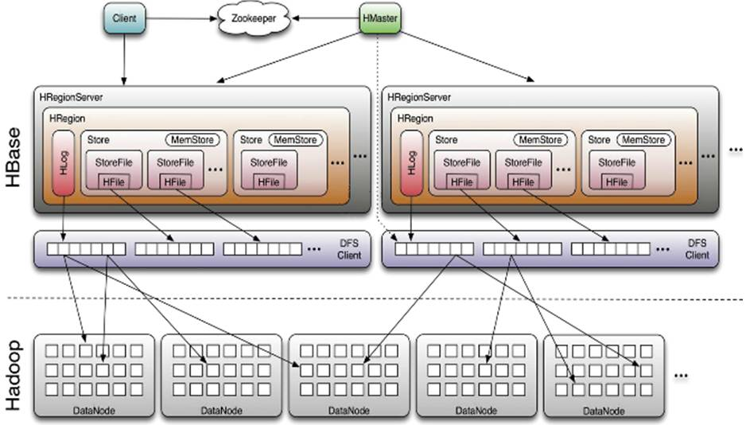
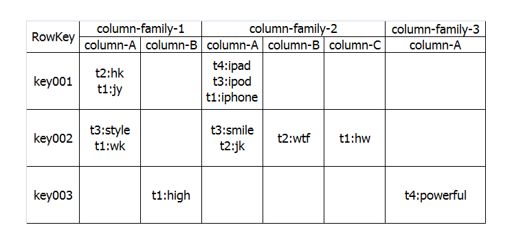
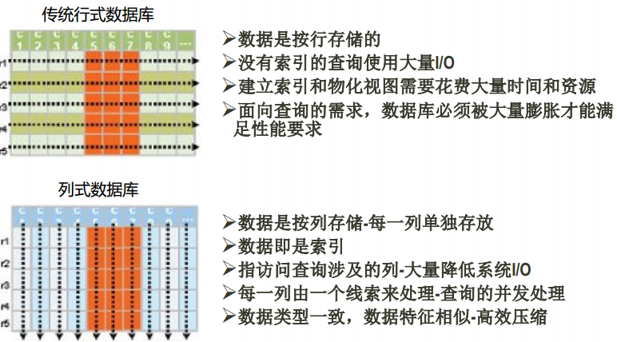
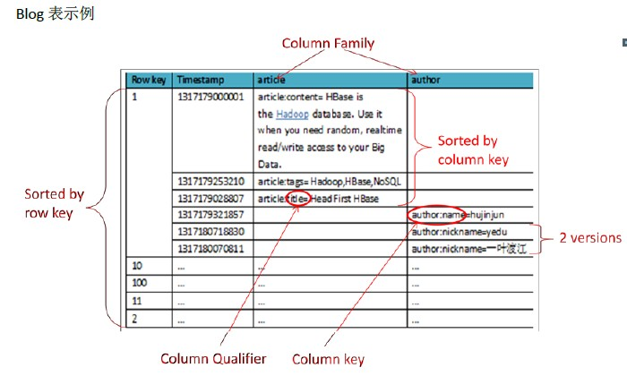

# 第十一章 HBASE

## 一 引子
在说Hase是个啥家伙之前，首先我们来看看两个概念，面向行存储和面向列存储。面向行存储，我相信大伙儿应该都清楚，我们熟悉的RDBMS就是此种类型的，面向行存储的数据库主要适合于事务性要求严格场合，或者说面向行存储的存储系统适合OLTP，但是根据CAP理论(参考:[CAP理论参考](http://baike.baidu.com/link?url=NTSj4qz7lU3y3D28k9jpctvINzHHmNx0IMx1NQVZSTDudDwNIF-LDa6O8tEW8W5kfC-cGBteEWu_UTIyVqsGBa))，传统的RDBMS，为了实现强一致性，通过严格的ACID事务来进行同步，这就造成了系统的可用性和伸缩性方面大大折扣，而目前的很多NoSQL产品，包括Hbase，它们都是一种最终一致性的系统，它们为了高的可用性牺牲了一部分的一致性。好像，我上面说了面向列存储，那么到底什么是面向列存储呢？Hbase,Casandra,Bigtable都属于面向列存储的分布式存储系统。看到这里，如果您不明白Hbase是个啥东东，不要紧，我再总结一下下：

Hbase是一个面向列存储的分布式存储系统，它的优点在于可以实现高性能的并发读写操作，同时Hbase还会对数据进行透明的切分，这样就使得存储本身具有了水平伸缩性。

## 二 Hbase是个啥东东？

HBase建立在HDFS之上，提供高可靠性、高性能、列存储、可伸缩、实时读写的数据库系统。它介于NoSQL和RDBMS之间，仅能通过行键(row key)和行键序列来检索数据，仅支持单行事务(可通过Hive支持来实现多表联合等复杂操作)。主要用来存储非结构化和半结构化的松散数据。与Hadoop一样，HBase目标主要依靠横向扩展，通过不断增加廉价的商用服务器，来增加计算和存储能力。

**HBase表一般有这样的特点：**

* 大：一个表可以有上亿行，上百万列
* 面向列：面向列(族)的存储和权限控制，列(族)独立检索。
* 稀疏：对于为空(null)的列，并不占用存储空间，因此，表可以设计的非常稀疏。

## 三 HBase体系架构               

HBase的服务器体系结构遵循简单的主从服务器架构。它由HRegion Server和HMaster组成，HMaster负责管理所有的HRegion Server，HBase中所有的服务器都通过ZooKeeper来协调。HBase的体系结构如下图所示。




## 四 Hbase的二类数据模型 

HBASE的二类数据模型是指从逻辑模型与物理模型来了解Hbase的数据模型,表是HBase表达数据的逻辑组织方式,而基于列的存储则是数据在底层的组织方式.

### 1 逻辑模型
HBase,Cassandra的数据模型非常类似，他们的思想都是来源于Google的Bigtable，因此这三者的数据模型非常类似，唯一不同的就是Cassandra具有Super cloumn family的概念，而Hbase目前我没发现。

在Hbase里面有以下两个主要的概念，Row key,Column Family，我们首先来看看Column family,Column family中文又名“列族”，Column family是在系统启动之前预先定义好的，每一个Column Family都可以根据“限定符”有多个column.下面我们来举个例子就会非常的清晰了。

假如系统中有一个User表，如果按照传统的RDBMS的话，User表中的列是固定的，比如schema 定义了name,age,sex等属性，User的属性是不能动态增加的。但是如果采用列存储系统，比如Hbase，那么我们可以定义User表，然后定义info 列族，User的数据可以分为：info:name = zhangsan,info:age=30,info:sex=male等，如果后来你又想增加另外的属性，这样很方便只需要info:newProperty就可以了。

也许前面的这个例子还不够清晰，我们再举个例子来解释一下，熟悉SNS的朋友，应该都知道有好友Feed，一般设计Feed，我们都是按照“某人在某时做了标题为某某的事情”，但是同时一般我们也会预留一下关键字，比如有时候feed也许需要url，feed需要image属性等，这样来说，feed本身的属性是不确定的，因此如果采用传统的关系数据库将非常麻烦，况且关系数据库会造成一些为null的单元浪费，而列存储就不会出现这个问题，在Hbase里，如果每一个column 单元没有值，那么是占用空间的。下面我们通过两张图来形象的表示这种关系：


上图是传统的RDBMS设计的Feed表，我们可以看出feed有多少列是固定的，不能增加，并且为null的列浪费了空间。但是我们再看看下图，下图为Hbase，Cassandra,Bigtable的数据模型图，从下图可以看出，Feed表的列可以动态的增加，并且为空的列是不存储的，这就大大节约了空间，关键是Feed这东西随着系统的运行，各种各样的Feed会出现，我们事先没办法预测有多少种Feed，那么我们也就没有办法确定Feed表有多少列，因此Hbase,Cassandra,Bigtable的基于列存储的数据模型就非常适合此场景。说到这里，采用Hbase的这种方式，还有一个非常重要的好处就是Feed会自动切分，当Feed表中的数据超过某一个阀值以后，Hbase会自动为我们切分数据，这样的话，查询就具有了伸缩性，而再加上Hbase的弱事务性的特性，对Hbase的写入操作也将变得非常快。



上面说了Column family，那么我之前说的Row key是啥东东，其实你可以理解row key为RDBMS中的某一个行的主键，但是因为Hbase不支持条件查询以及Order by等查询，因此Row key的设计就要根据你系统的查询需求来设计了额。我还拿刚才那个Feed的列子来说，我们一般是查询某个人最新的一些Feed，因此我们Feed的Row key可以有以下三个部分构成<userId><timestamp><feedId>，这样以来当我们要查询某个人的最进的Feed就可以指定Start Rowkey为<userId><0><0>，End Rowkey为<userId><Long.MAX_VALUE><Long.MAX_VALUE>来查询了，同时因为Hbase中的记录是按照rowkey来排序的，这样就使得查询变得非常快。




### 2 物理模型
虽然在逻辑


##五 HBase and Hive？

### 1 HBase实例及代码解释

要想使用HBase存取数据必须要有两个步骤：

1、建立HBase表

```
create 'test','info'
put 'test1','101','info:name','wang'
put 'test1','101','info:sex','female'

put 'test2','102','info:name','zhang'
put 'test2','102','info:sex','male'

get 'test','101'
```


上面创建了一个HBase的test表，用于HBase和数据库做映射使用，同时往这个表里put了两行数据，分别是101和102（row key），info代表列簇，包含了name和sex两列的值

2、建立HBase外表

```
create external table hbase_test(id string, name string,sex string)
stored by 'org.apache.hadoop.hive.hbase.HBaseStorageHandler'
with serdeproperties('hbase.columns.mapping'=':key,info:name,info:sex') tblproperties('hbase.table.name'='test');
```


上述建立了一张外表，stored by制定HBase的存储格式，with后面是序列化和反序列化，作用是进行map映射，从上面的语句可以看出，将id映射成了key、将name、和sex映射成了info（列簇）


