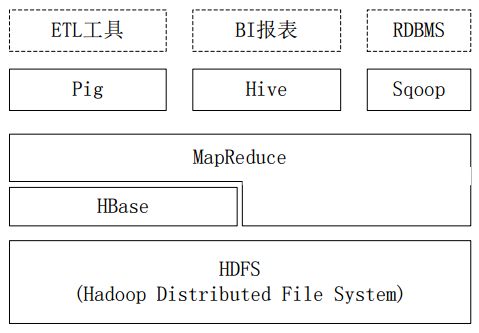

# 第十一章 HBASE

## 一 引子

在说HBase之前，我想再唠叨几句。做互联网应用的哥们儿应该都清楚，互联网应用这东西，你没办法预测你的系统什么时候会被多少人访问，你面临的用户到底有多少，说不定今天你的用户还少，明天系统用户就变多了，结果您的系统应付不过来了了，不干了，这岂不是咱哥几个的悲哀，说时髦点就叫“杯具啊”。

其实说白了，这些就是事先没有认清楚互联网应用什么才是最重要的。从系统架构的角度来说，互联网应用更加看重系统性能以及伸缩性，而传统企业级应用都是比较看重数据完整性和数据安全性。

首先刚开始，人不多，压力也不大,搞一台数据库服务器就搞定了，此时所有的东东都塞进一个Server里，包括web server,app server,db server,但是随着人越来越多，系统压力越来越多，这个时候可能你把web server,app server和db server分离了，好歹这样可以应付一阵子，但是随着用户量的不断增加，你会发现，数据库这哥们不行了，速度老慢了，有时候还会宕掉，所以这个时候，你得给数据库这哥们找几个伴，这个时候Master-Salve就出现了，这个时候有一个Master Server专门负责接收写操作，另外的几个Salve Server专门进行读取，这样Master这哥们终于不抱怨了，总算读写分离了，压力总算轻点了,这个时候其实主要是对读取操作进行了水平扩张，通过增加多个Salve来克服查询时CPU瓶颈。一般这样下来，你的系统可以应付一定的压力，但是随着用户数量的增多，压力的不断增加，你会发现Master server这哥们的写压力还是变的太大，没办法，这个时候怎么办呢？你就得切分啊，俗话说“只有切分了，才会有伸缩性嘛”，所以啊，这个时候只能分库了，这也是我们常说的数据库“垂直切分”，比如将一些不关联的数据存放到不同的库中，分开部署，这样终于可以带走一部分的读取和写入压力了，Master又可以轻松一点了，但是随着数据的不断增多，你的数据库表中的数据又变的非常的大，这样查询效率非常低，这个时候就需要进行“水平分区”了，比如通过将User表中的数据按照10W来划分，这样每张表不会超过10W了。

综上所述，一般一个流行的web站点都会经历一个从单台DB，到主从复制，到垂直分区再到水平分区的痛苦的过程。其实数据库切分这事儿，看起来原理貌似很简单，如果真正做起来，我想凡是sharding过数据库的哥们儿都深受其苦啊。对于数据库伸缩的文章，哥们儿可以看看后面的参考资料介绍。

好了，从上面的那一堆废话中，我们也发现数据库存储水平扩张scale out是多么痛苦的一件事情，不过幸好技术在进步，业界的其它弟兄也在努力，09年这一年出现了非常多的NoSQL数据库，更准确的应该说是No relation数据库，这些数据库多数都会对非结构化的数据提供透明的水平扩张能力，大大减轻了哥们儿设计时候的压力。下面我就拿Hbase这分布式列存储系统来说说。

## 二 Hbase是个啥东东？

在说Hase是个啥家伙之前，首先我们来看看两个概念，面向行存储和面向列存储。面向行存储，我相信大伙儿应该都清楚，我们熟悉的RDBMS就是此种类型的，面向行存储的数据库主要适合于事务性要求严格场合，或者说面向行存储的存储系统适合OLTP，但是根据CAP理论(参考:[CAP理论参考](http://baike.baidu.com/link?url=NTSj4qz7lU3y3D28k9jpctvINzHHmNx0IMx1NQVZSTDudDwNIF-LDa6O8tEW8W5kfC-cGBteEWu_UTIyVqsGBa))，传统的RDBMS，为了实现强一致性，通过严格的ACID事务来进行同步，这就造成了系统的可用性和伸缩性方面大大折扣，而目前的很多NoSQL产品，包括Hbase，它们都是一种最终一致性的系统，它们为了高的可用性牺牲了一部分的一致性。好像，我上面说了面向列存储，那么到底什么是面向列存储呢？Hbase,Casandra,Bigtable都属于面向列存储的分布式存储系统。看到这里，如果您不明白Hbase是个啥东东，不要紧，我再总结一下下：
Hbase是一个面向列存储的分布式存储系统，它的优点在于可以实现高性能的并发读写操作，同时Hbase还会对数据进行透明的切分，这样就使得存储本身具有了水平伸缩性。


## 三 Hbase数据模型 
HBase,Cassandra的数据模型非常类似，他们的思想都是来源于Google的Bigtable，因此这三者的数据模型非常类似，唯一不同的就是Cassandra具有Super cloumn family的概念，而Hbase目前我没发现。好了，废话少说，我们来看看Hbase的数据模型到底是个啥东东。

在Hbase里面有以下两个主要的概念，Row key,Column Family，我们首先来看看Column family,Column family中文又名“列族”，Column family是在系统启动之前预先定义好的，每一个Column Family都可以根据“限定符”有多个column.下面我们来举个例子就会非常的清晰了。

假如系统中有一个User表，如果按照传统的RDBMS的话，User表中的列是固定的，比如schema 定义了name,age,sex等属性，User的属性是不能动态增加的。但是如果采用列存储系统，比如Hbase，那么我们可以定义User表，然后定义info 列族，User的数据可以分为：info:name = zhangsan,info:age=30,info:sex=male等，如果后来你又想增加另外的属性，这样很方便只需要info:newProperty就可以了。

也许前面的这个例子还不够清晰，我们再举个例子来解释一下，熟悉SNS的朋友，应该都知道有好友Feed，一般设计Feed，我们都是按照“某人在某时做了标题为某某的事情”，但是同时一般我们也会预留一下关键字，比如有时候feed也许需要url，feed需要image属性等，这样来说，feed本身的属性是不确定的，因此如果采用传统的关系数据库将非常麻烦，况且关系数据库会造成一些为null的单元浪费，而列存储就不会出现这个问题，在Hbase里，如果每一个column 单元没有值，那么是占用空间的。下面我们通过两张图来形象的表示这种关系：


上图是传统的RDBMS设计的Feed表，我们可以看出feed有多少列是固定的，不能增加，并且为null的列浪费了空间。但是我们再看看下图，下图为Hbase，Cassandra,Bigtable的数据模型图，从下图可以看出，Feed表的列可以动态的增加，并且为空的列是不存储的，这就大大节约了空间，关键是Feed这东西随着系统的运行，各种各样的Feed会出现，我们事先没办法预测有多少种Feed，那么我们也就没有办法确定Feed表有多少列，因此Hbase,Cassandra,Bigtable的基于列存储的数据模型就非常适合此场景。说到这里，采用Hbase的这种方式，还有一个非常重要的好处就是Feed会自动切分，当Feed表中的数据超过某一个阀值以后，Hbase会自动为我们切分数据，这样的话，查询就具有了伸缩性，而再加上Hbase的弱事务性的特性，对Hbase的写入操作也将变得非常快。

上面说了Column family，那么我之前说的Row key是啥东东，其实你可以理解row key为RDBMS中的某一个行的主键，但是因为Hbase不支持条件查询以及Order by等查询，因此Row key的设计就要根据你系统的查询需求来设计了额。我还拿刚才那个Feed的列子来说，我们一般是查询某个人最新的一些Feed，因此我们Feed的Row key可以有以下三个部分构成<userId><timestamp><feedId>，这样以来当我们要查询某个人的最进的Feed就可以指定Start Rowkey为<userId><0><0>，End Rowkey为<userId><Long.MAX_VALUE><Long.MAX_VALUE>来查询了，同时因为Hbase中的记录是按照rowkey来排序的，这样就使得查询变得非常快。


##2、HBase and Hive？

###2.1、HBase和Hive联系与区别

星环的Inceptor-SQL就是将开源的HiveQL进行了二次开发，主要增加了JDBC、ODBC和对SQL-2003解释器的强大功能，那么和HBase有什么区别和联系呢？

这里我大致的将各个关系进行映射，大家就可以明白了

```
Inceptor-SQL ————> HiveQL
Hyperbase    ————> HBase
```


再看下面这张图




HiveQL操作底层实际上都是一个个MapReduce或者Spark任务，也就是说，Hive可以访问HDFS上的数据做数据分析，也可以对HBase做数据分析，因为真正的数据要么存放在HDFS分布式文件系统上，要么存放在HBase数据库上。


###2.2、HBase实例及代码解释

要想使用HBase存取数据必须要有两个步骤：

1、建立HBase表

```
create 'test','info'
put 'test1','101','info:name','wang'
put 'test1','101','info:sex','female'

put 'test2','102','info:name','zhang'
put 'test2','102','info:sex','male'

get 'test','101'
```


上面创建了一个HBase的test表，用于HBase和数据库做映射使用，同时往这个表里put了两行数据，分别是101和102（row key），info代表列簇，包含了name和sex两列的值

2、建立HBase外表

```
create external table hbase_test(id string, name string,sex string)
stored by 'org.apache.hadoop.hive.hbase.HBaseStorageHandler'
with serdeproperties('hbase.columns.mapping'=':key,info:name,info:sex') tblproperties('hbase.table.name'='test');
```


上述建立了一张外表，stored by制定HBase的存储格式，with后面是序列化和反序列化，作用是进行map映射，从上面的语句可以看出，将id映射成了key、将name、和sex映射成了info（列簇）


