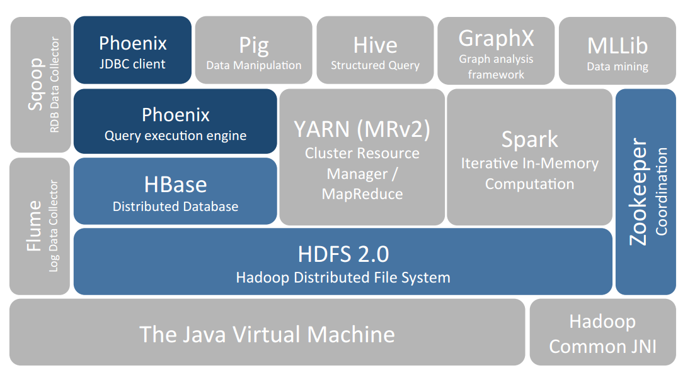
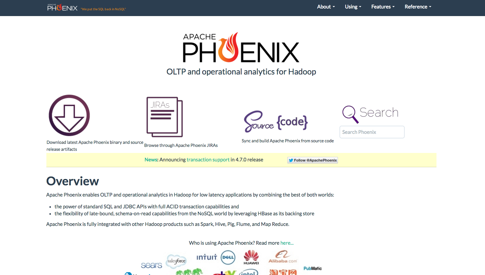

# 一 整合SQL引擎层

1. NOSQL(Not only  SQL 非关系型数据库)的特性之一是不使用SQL作为查询语言,本节简单介绍NOSQL定义,为何NOSQL 上定义SQL引擎,以及现有基于HBASE的SQL引擎的具体实现
2. NOSQL是不同于传统关系型数据库的数据库系统的统称.两者有很多显著的不同点,其中最重要的是NOSQL不使用SQL作为查询语言.其数据存储可以不需要固定的表格模式,也经常会避免使用SQL的JOIN操作,一般具备水平扩展的特征.NOSQL的实现具有两个特征:使用硬盘或者把随机存储器作为存储媒体

## 1 把SQL整合到HBASE的原因
现有的SQL解决方案通常都不是水平可伸缩的,因此当数据量变大时会遇到阻力.我们已经知道NOSQL区别于关系型数据库的一点就是NOSQL不使用SQL作为查询语言,至于为何在NOSQL数据存储HBASE上提供SQL接口,有如下三个原因:

1. 使用诸如SQL这样易于理解的语言,使人们能够更加轻松地使用HBASE
2. 使用诸如SQL这样更高层次的语言来编写,减少了编码的代码量.
3. 执行查询时,在数据访问与运行时执行之间加上SQL这样一层抽象可以进行大量优化.

## 2 基于HBASE的SQL引擎实现

现阶段业内有一些HBASE SQL引擎层的尝试

### Hive 整合HBASE
Hive与HBASE的整合功能从Hive0.6版本开始出现,利用两者对外的API接口互相通信,通信主要依赖hive_hbase-handler.jar工具包(Hive Storage Handlers).由于HBASE有一次比较大的版本变动,所以并不是每个版本的Hive都能和现有的HBASE版本进行整合,因此对版本的范围要求比较严格.


### Phoenix
Phoenix由Saleforce.com开源,是构建在Apache Hbase之上的一个SQL中间层,可以让开发者在HBASE上执行SQL查询.Phoenix完全使用Java开发,并且提供一个客户端可嵌入的JDBC驱动.对于简单的低延迟查询,其量级为毫秒,对于百万级别的行数来说,其量级为秒.Phoenix并不像HBase那样用于map-reduce job,而是通过标准化的语言来访问HBASE数据.根据项目创建者所述,对于10万到100万行的简单查询来说,Phoenix要胜过Hive.对于使用了HBASE API,协同处理器及自定义过滤器的Impala与OpenTSDB来说,进行相似的查询Phoenix的速度也要更快一些.

### Impala
Cloudera发布实时查询开源项目Impala,经多款产品实测表明,比原来基于MapReduce的Hive SQL查询速度提升了3-90倍,Impala是google dremel的模仿,但在SQL功能上青出于蓝.

Impala采用与Hive相同的元数据,SQL语法 ODBC驱动和用户接口,但是对于平台有一定的局限性在CDH上表现良好,在其他平台上兼容性不好.


# 二 Phoenix的安装与使用
##1 概述
Apache Phoenix是构建在HBase之上的关系型数据库层，作为内嵌的客户端JDBC驱动用以对HBase中的数据进行低延迟访问。Apache Phoenix会将用户编写的sql查询编译为一系列的scan操作，最终产生通用的JDBC结果集返回给客户端。数据表的元数据存储在HBase的表中被会标记版本号，所以进行查询的时候会自动选择正确的schema。直接使用HBase的API，结合协处理器（coprocessor）和自定义的过滤器的话，小范围的查询在毫秒级响应，千万数据的话响应速度为秒级。


## 2 Phoenix的特点

1. 嵌入式的JDBC驱动,实现了大部分的Java.sql接口,包括元数据API
2. 可以通过多行键/值单元对列进行建模
3. 完善的查询支持,优化过scan
4. DDL支持:通过CREATE TABLE DROP TABLE  ALETR TABLE实现
5. 版本化的模式仓库:当写入数据时,快照查询会使用适当的模式
6. DML支持:用于逐行插入的UPSERT VALUES ,用于相同或不同表之间大量数据传输的UPSERT SELECT,用于删除行的DELETE
7. 通过客户端的批处理实现的有限事务支持
8. 紧跟ANSI SQL标准

不同于Hive On HBASE的方式,Phoenix将Query Plan直接使用HBASE API实现,规避MapReduce框架,减少查询的时间延迟.Phoenix中SQL Query Plan的执行,基本上是通过构建一系列HBASE Scan来完成的.

目前支持简单的表创建,修改,数据删除过滤查询等SQL语句,从语法上看,不支持多表操作,由于不支持多表联合类的操作如各种Join等,所以在Where部分也就不能做多表比较.基于HBASE的timestamp和不限制修饰符等等特性,实现了一些有趣的功能,比如动态列,嵌套数据结构,schema演化等.

由于协处理器和过滤器自身能力的限制,如果完全不依赖MapReduce框架,只通过HBASE客户端API想要实现复杂查询操作,如多表联合操作,相对比较困难,或者大量工作需要在客户端代码中实现,性能上可能无法满足需求.


##(1)下载
访问Phoenix的官方网站进行下载.下载地址:[http://www.apache.org/dyn/closer.lua/phoenix/](http://www.apache.org/dyn/closer.lua/phoenix/)

##(2)安装
**在Master上面的操作**

```
#sudo tar xvfz phoenix-4.7.0-HBase-1.1-bin.tar.gz 
#sudo chown -R hadoop:hadoop phoenix-4.7.0-HBase-1.1
#sudo chmod -R 775 phoenix-4.7.0-HBase-1.1
#sudo mv phoenix-4.7.0-HBase-1.1 /usr/local/phoenix
#sudo cp /usr/local/phoenix/*.jar /usr/local/hbase/lib/
#sudo cp /usr/local/hbase/conf/hbase-site.xml /usr/local/phoenix/bin/
hadoop@hadoopmaster:/usr/local$ sudo tar cvfz ~/phoenix2016.tar.gz phoenix/
scp /home/hadoop/phoenix2016.tar.gz hadoop@hadoopslave1:/home/hadoop/
scp /home/hadoop/phoenix2016.tar.gz hadoop@hadoopslave2:/home/hadoop/
```

**在Slave上面的操作**

```
hadoop@hadoopslave1:~$ tar xvfz phoenix2016.tar.gz
hadoop@hadoopslave1:~$ sudo mv phoenix /usr/local/phoenix
hadoop@hadoopslave1:~$ sudo chown -R hadoop:hadoop /usr/local/phoenix/
hadoop@hadoopslave1:~$ sudo chmod -R 775 /usr/local/phoenix/
hadoop@hadoopslave1:/usr/local/phoenix$ cp *.jar /usr/local/hbase/lib/
```

完成以上步骤,基本上Phoenix就安装成功了.

##(3)基本使用
###验证操作

```
hadoop@Master:/usr/local/phoenix/bin$ ./sqlline.py localhost
执行SQL语句
CREATE TABLE IF NOT EXISTS us_population2 (
      state CHAR(2) NOT NULL,
      city VARCHAR NOT NULL,
      population BIGINT
      CONSTRAINT my_pk2 PRIMARY KEY (state, city));
      
插入操作

upsert into us_population2(state, city, population) values('NY', 'New York', 8143197);
upsert into us_population2(state, city, population) values('CA', 'Chicago', 2842518);
upsert into us_population2(state, city, population) values('TX', 'Houston', 2016582);
upsert into us_population2(state, city, population) values('TX', 'San Antonio', 1256509);
upsert into us_population2(state, city, population) values('CA', 'San Jose', 912332);

执行操作

SELECT state as "State",count(city) as "City Count",sum(population) as "Population Sum"
FROM us_population2
GROUP BY state
ORDER BY sum(population) DESC;

0: jdbc:phoenix:localhost> SELECT state as "State",count(city) as "City Count",sum(population) as "Population Sum"
. . . . . . . . . . . . .> FROM us_population2
. . . . . . . . . . . . .> GROUP BY state
. . . . . . . . . . . . .> ORDER BY sum(population) DESC;
+--------+-------------+-----------------+
| State  | City Count  | Population Sum  |
+--------+-------------+-----------------+
| NY     | 1           | 8143197         |
| CA     | 2           | 3754850         |
| TX     | 2           | 3273091         |
+--------+-------------+-----------------+
3 rows selected (0.087 seconds)
0: jdbc:phoenix:localhost> 


```

###语法索引
[http://phoenix.apache.org/language/index.html](http://phoenix.apache.org/language/index.html)

## 使用JDBC访问Phoenix

```
package com.chu;

/**
 * Created by chuguangming on 16/9/23.
 */

import java.sql.*;


class BaseDB {

    /**
     * name：getConnection
     * time：2015年5月6日 下午2:07:06
     * description： get JDBC connection
     *
     * @return connection
     */
    public static Connection getConnection() {
        try {
            // load driver
            Class.forName("org.apache.phoenix.jdbc.PhoenixDriver");

            // get connection
            // jdbc 的 url 类似为 jdbc:phoenix [ :<zookeeper quorum> [ :<port number> ] [ :<root node> ] ]，
            // 需要引用三个参数：hbase.zookeeper.quorum、hbase.zookeeper.property.clientPort、and zookeeper.znode.parent，
            // 这些参数可以缺省不填而在 hbase-site.xml 中定义。
            return DriverManager.getConnection("jdbc:phoenix:hadoopmaster,hadoopslave1,hadoopslave2");
        } catch (Exception e) {
            e.printStackTrace();
            return null;
        }
    }


}


public class HBaseSQLDriverTest {
    public static void main(String[] args) throws SQLException {
        //Simpletest();
        //create();
        //upsert();
        //query();
        //delete();
    }

    /**
     * name：delete
     * time：2015年5月4日 下午4:03:11
     * description：delete data
     */
    public static void delete() {

        Connection conn = null;
        try {
            // get connection
            conn = BaseDB.getConnection();

            // check connection
            if (conn == null) {
                System.out.println("conn is null...");
                return;
            }

            // create sql
            String sql = "delete from user88888 where id='001'";

            PreparedStatement ps = conn.prepareStatement(sql);

            // execute upsert
            String msg = ps.executeUpdate() > 0 ? "delete success..."
                    : "delete fail...";

            // you must commit
            conn.commit();
            System.out.println(msg);

        } catch (SQLException e) {
            e.printStackTrace();
        } finally {
            if (conn != null) {
                try {
                    conn.close();
                } catch (SQLException e) {
                    e.printStackTrace();
                }
            }
        }

    }

    public static void query() {

        Connection conn = null;
        try {
            // get connection
            conn = BaseDB.getConnection();

            // check connection
            if (conn == null) {
                System.out.println("conn is null...");
                return;
            }

            // create sql
            String sql = "select * from user88888";

            PreparedStatement ps = conn.prepareStatement(sql);

            ResultSet rs = ps.executeQuery();

            System.out.println("id" + "\t" + "account" + "\t" + "passwd");
            System.out.println("======================");

            if (rs != null) {
                while (rs.next()) {
                    System.out.print(rs.getString("id") + "\t");
                    System.out.print(rs.getString("account") + "\t");
                    System.out.println(rs.getString("passwd"));
                }
            }

        } catch (SQLException e) {
            e.printStackTrace();
        } finally {
            if (conn != null) {
                try {
                    conn.close();
                } catch (SQLException e) {
                    e.printStackTrace();
                }
            }
        }

    }

    /**
     * name：insert
     * time：2015年5月4日 下午2:59:11
     * description：
     */
    public static void upsert() {

        Connection conn = null;
        try {
            // get connection
            conn = BaseDB.getConnection();

            // check connection
            if (conn == null) {
                System.out.println("conn is null...");
                return;
            }

            // create sql
            String sql = "upsert into user88888(id, INFO.account, INFO.passwd) values('001', 'admin', 'admin')";

            PreparedStatement ps = conn.prepareStatement(sql);

            // execute upsert
            String msg = ps.executeUpdate() > 0 ? "insert success..."
                    : "insert fail...";

            // you must commit
            conn.commit();
            System.out.println(msg);

        } catch (SQLException e) {
            e.printStackTrace();
        } finally {
            if (conn != null) {
                try {
                    conn.close();
                } catch (SQLException e) {
                    e.printStackTrace();
                }
            }
        }
    }

    public static void create() {
        Connection conn = null;
        try {
            // get connection
            conn = BaseDB.getConnection();

            // check connection
            if (conn == null) {
                System.out.println("conn is null...");
                return;
            }

            // check if the table exist
            ResultSet rs = conn.getMetaData().getTables(null, null, "USER",
                    null);
            if (rs.next()) {
                System.out.println("table user is exist...");
                return;
            }
            // create sql
            String sql = "CREATE TABLE user88888 (id varchar PRIMARY KEY,INFO.account varchar ,INFO.passwd varchar)";

            PreparedStatement ps = conn.prepareStatement(sql);

            // execute
            ps.execute();
            System.out.println("create success...");

        } catch (SQLException e) {
            e.printStackTrace();
        } finally {
            if (conn != null) {
                try {
                    conn.close();
                } catch (SQLException e) {
                    e.printStackTrace();
                }
            }
        }

    }

    private static void Simpletest() throws SQLException {
        Statement stmt = null;
        ResultSet rs = null;
        String viewName = "\"US_POPULATION2\""; // 这是对HBase表"food:products"创建的Phoenix view

        System.err.println("\n[viewName = " + viewName + "]\n");

        /* ecs1.njzd.com:2181是zookeeper的某一个节点的ip:port
           即使集群中的ZooKeeper存在多个节点，这里也只需要写出一个节点的ip:port就可以了*/
        // 如果是Scala，还需要这一句
        //Class.forName("org.apache.phoenix.jdbc.PhoenixDriver");
        Connection conn = DriverManager.getConnection("jdbc:phoenix:hadoopmaster,hadoopslave1,hadoopslave2");

        /* 在Phoenix中，如果table name/view name、column name等字符串不加上双引号就会被认为是大写。所以，这里的brand_name要加上双引号  */
        PreparedStatement pstmt = conn.prepareStatement("select * from " + viewName);
        rs = pstmt.executeQuery();

        while (rs.next()) {

            System.err.println(rs.getString("STATE"));

            System.err.println("\n=========================================================");
        }
        /* 关闭资源*/
        rs.close();
        pstmt.close();
    }
}

```

pom.xml

```
<?xml version="1.0" encoding="UTF-8"?>
<project xmlns="http://maven.apache.org/POM/4.0.0"
         xmlns:xsi="http://www.w3.org/2001/XMLSchema-instance"
         xsi:schemaLocation="http://maven.apache.org/POM/4.0.0 http://maven.apache.org/xsd/maven-4.0.0.xsd">
    <modelVersion>4.0.0</modelVersion>

    <groupId>com.chu</groupId>
    <artifactId>HBaseDemo</artifactId>
    <version>1.0-SNAPSHOT</version>
    <dependencies>
        <!-- https://mvnrepository.com/artifact/org.apache.hive/hive-jdbc -->
        <dependency>
            <groupId>org.apache.hive</groupId>
            <artifactId>hive-jdbc</artifactId>
            <version>2.1.0</version>
        </dependency>
        <!-- https://mvnrepository.com/artifact/org.hibernate.javax.persistence/hibernate-jpa-2.0-api -->
        <dependency>
            <groupId>org.hibernate.javax.persistence</groupId>
            <artifactId>hibernate-jpa-2.0-api</artifactId>
            <version>1.0.1.Final</version>
        </dependency>
        <dependency>
            <groupId>org.apache.hive</groupId>
            <artifactId>hive-exec</artifactId>
            <version>2.1.0</version>
        </dependency>
        <!-- https://mvnrepository.com/artifact/org.apache.hbase/hbase-client -->
        <dependency>
            <groupId>org.apache.hbase</groupId>
            <artifactId>hbase-client</artifactId>
            <version>1.1.5</version>
        </dependency>
        <!-- https://mvnrepository.com/artifact/org.apache.hbase/hbase -->
        <dependency>
            <groupId>org.apache.hbase</groupId>
            <artifactId>hbase</artifactId>
            <version>1.1.5</version>
            <type>pom</type>
        </dependency>
        <!-- https://mvnrepository.com/artifact/org.apache.hbase/hbase-common -->
        <dependency>
            <groupId>org.apache.hbase</groupId>
            <artifactId>hbase-common</artifactId>
            <version>1.1.5</version>
        </dependency>
        <!-- https://mvnrepository.com/artifact/org.apache.hbase/hbase-server -->
        <dependency>
            <groupId>org.apache.hbase</groupId>
            <artifactId>hbase-server</artifactId>
            <version>1.1.5</version>
        </dependency>
        <!-- https://mvnrepository.com/artifact/org.apache.hbase/hbase-protocol -->
        <dependency>
            <groupId>org.apache.hbase</groupId>
            <artifactId>hbase-protocol</artifactId>
            <version>1.1.5</version>
        </dependency>
        <!-- https://mvnrepository.com/artifact/org.apache.phoenix/phoenix-core -->
        <dependency>
            <groupId>org.apache.phoenix</groupId>
            <artifactId>phoenix-core</artifactId>
            <version>4.7.0-HBase-1.1</version>
        </dependency>

    </dependencies>
    <repositories>
        <repository>
            <id>jboss</id>
            <url>http://maven.aliyun.com/nexus/content/groups/public/</url>
        </repository>
    </repositories>
</project>
```

