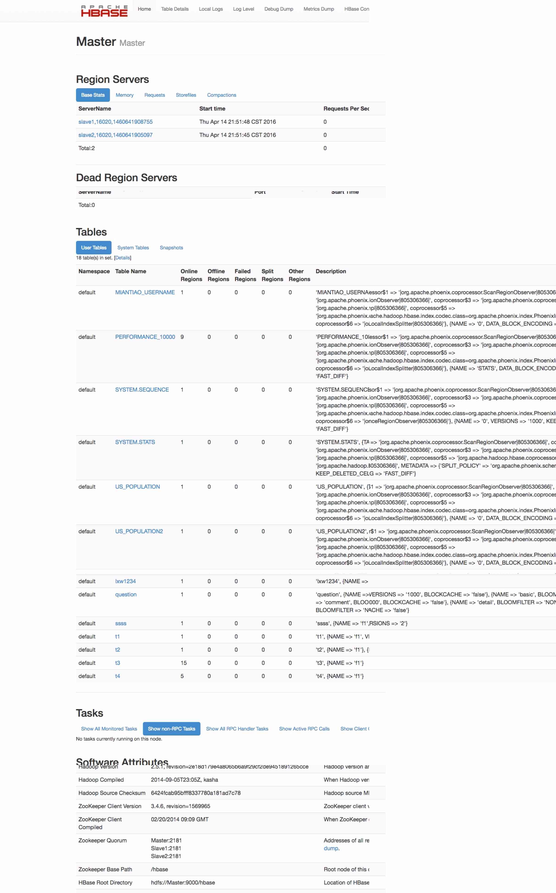

# 5.使用管理工具

每个人都希望自已的HBASE管理员能够让集群运行流畅,存储大量的数据,并且能同时,迅速和可靠地处理几百万的并发请求.对于管理员来说,让HBASE中海量数据一直保持可存取,易管理和便于查询是一项至关重要的任务.

除了对于你运行的集群要有扎实的了解之外,你所使用的工具也同样重要.HBASE自带了一些管理工具,它可以使管理员的工作变得轻松一些.HBASE带有一个基于WEB的管理页面.在此页面中可以查看集群的状态.

##1.HBASE主WEB界面
HBASE主WEB界面是一个简单而又有用的工具,它可以为我们提供集群当前的状态的概况.从该页面中可以获取所运行HBASE版本/HBASE的配置(包括HDFS根路径和ZOOKeeper仲裁地址)/集群的平均负载以及表/区域/区域服务器的列表.

HBASE主界面的默认端口是60010,请确保你的网络防火墙已经对你的客户端打开了该端口.

```
http://192.168.1.80:16010/master-status
```
HBASE主WEB界面如下



正如你所看到的那样,在"Attributes区中显示的信息有":HBASE和Hadoop的版本/HBASE在HDFS上的根目录/集群的平均负载以及Zookeeper仲裁地址.HBASE根目录和Zookeeper服务器地址是HBASE配置文件hbase-site.xml中设置的值.平均负载是每个区域服务器所负责区域的平均值.一个区域服务器的负载显示在Region Server区中.

在Catalog Table(目录表)区中你可以看到两张表:-ROOT和.META.这是两张HBASE的系统表,-ROOT表里保存的是部署有.META表所有区域服务器的引用,而.META表中保存的是所有用户表区域的引用.


##使用HBASE SHELL管理表
我们现在通过下列步骤来展示如何使用DDL命令来管理HBASE表.
```
1.在客户机节点上执行以下命仅启动HBASE SHELL
#hbase shell


2.在HBASE SHELL中使用create命令创建一张带有一个列族(f1)的表(t1)
hbase(main):001:0> create 't1','f1'


3.使用list命令列出所有表的列表
hbase(main):008:0> list
TABLE                                                                                                                              
MIANTIAO_USERNAME                                                                                                                  
PERFORMANCE_10000                                                                                                                  
SYSTEM.CATALOG                                                                                                                     
SYSTEM.FUNCTION                                                                                                                    
SYSTEM.SEQUENCE                                                                                                                    
SYSTEM.STATS                                                                                                                       
US_POPULATION                                                                                                                      
US_POPULATION2                                                                                                                     
UUU                                                                                                                                
UUU33                                                                                                                              
hly_temp                                                                                                                           
lxw1234                                                                                                                            
question                                                                                                                           
ssss                                                                                                                               
t1                                                                                                                                 
t2                                                                                                                                 
t3                                                                                                                                 
t4                                                                                                                                 
18 row(s) in 0.0370 seconds

=> ["MIANTIAO_USERNAME", "PERFORMANCE_10000", "SYSTEM.CATALOG", "SYSTEM.FUNCTION", "SYSTEM.SEQUENCE", "SYSTEM.STATS", "US_POPULATION", "US_POPULATION2", "UUU", "UUU33", "hly_temp", "lxw1234", "question", "ssss", "t1", "t2", "t3", "t4"]
hbase(main):009:0> 


4.使用describe命令来显示该表的属性
hbase(main):009:0> describe 't1'
Table t1 is ENABLED                                                                                                                
t1                                                                                                                                 
COLUMN FAMILIES DESCRIPTION                                                                                                        
{NAME => 'f1', BLOOMFILTER => 'ROW', VERSIONS => '5', IN_MEMORY => 'false', KEEP_DELETED_CELLS => 'FALSE', DATA_BLOCK_ENCODING => '
NONE', TTL => 'FOREVER', COMPRESSION => 'NONE', MIN_VERSIONS => '0', BLOCKCACHE => 'true', BLOCKSIZE => '65536', REPLICATION_SCOPE 
=> '0'}                                                                                                                            
1 row(s) in 0.1840 seconds


5.使用disable 命令来禁用该表
hbase(main):013:0> disable 't1'
0 row(s) in 0.0170 seconds

hbase(main):014:0> is_enabled 't1'
false                                                                                                                              
0 row(s) in 0.0160 seconds


6.使用alter命令来修改表的属性.下面这段代码会先将f1修改为只有一个版本,然后再添加了一个新列族的f2
hbase(main):015:0> alter 't1',{NAME=>'f1',VERSIONS=>'1'},{NAME=>'f2'}
Updating all regions with the new schema...
1/1 regions updated.
Done.
Updating all regions with the new schema...
1/1 regions updated.
Done.
0 row(s) in 3.8100 seconds


7.使用enable命令来启用该表
hbase(main):016:0> enable 't1'
0 row(s) in 1.4190 seconds

hbase(main):017:0> is_enabled 't1'
true                                                                                                                               
0 row(s) in 0.0090 seconds


8.输入以下命令来再次禁用该表.然后将期删除
hbase(main):018:0> disable 't1'
0 row(s) in 2.2440 seconds

hbase(main):019:0> drop 't1'
0 row(s) in 1.2650 seconds


9.使用put命令将下列数据插入到该表中
hbase(main):021:0> put 't1','row1','f1:c1','value1'
0 row(s) in 0.1030 seconds

hbase(main):022:0> put 't1','row1','f1:c2','value2'
0 row(s) in 0.0130 seconds

hbase(main):023:0> put 't1','row2','f1:c1','value3'
0 row(s) in 0.0230 seconds
put命令使用表名(t1)/行键(row1)/列族和限定符(f1:c1)以及要赋予的值(value1)为参数,别外它还有一个可选的时间戳参数.在f1:c1中.冒号(:)是列族(f1)与限定符(c1)之前的间隔符.在HBASE SHELL中,如果想要把一个值当成字符串,你就用单引号包括起来就行.


10.执行count命令来获取该表的行数
hbase(main):024:0> count 't1'
2 row(s) in 0.0930 seconds

=> 2
count命令可以统计一张表中记录数,它会以"行键"为基础进行统计,所以为2.

11.使用scan命令来扫描数据.在对记录很多的表进行scan时,不要忘记指定LIMIT属性
hbase(main):029:0> scan 't1',{LIMIT=>10}
ROW                               COLUMN+CELL                                                                                      
 row1                             column=f1:c1, timestamp=1460644326819, value=value1                                              
 row1                             column=f1:c2, timestamp=1460644335627, value=value2                                              
 row2                             column=f1:c1, timestamp=1460644754895, value=value7                                              
 row3                             column=f1:c1, timestamp=1460644762929, value=value7                                              
3 row(s) in 0.0600 seconds


12.使用get命令来读取某一行
hbase(main):030:0> get 't1','row1'
COLUMN                            CELL                                                                                             
 f1:c1                            timestamp=1460644326819, value=value1                                                            
 f1:c2                            timestamp=1460644335627, value=value2                                                            
2 row(s) in 0.0200 seconds


13.使用delete命令来删除某一指定单元格
hbase(main):032:0> delete 't1','row1','f1:c1'
0 row(s) in 0.0250 seconds

hbase(main):033:0> scan 't1',{LIMIT=>10}
ROW                               COLUMN+CELL                                                                                      
 row1                             column=f1:c2, timestamp=1460644335627, value=value2                                              
 row2                             column=f1:c1, timestamp=1460644754895, value=value7                                              
 row3                             column=f1:c1, timestamp=1460644762929, value=value7                                              
3 row(s) in 0.0240 seconds


14.使用deleteall命令删除某一指定行的所有单元格
hbase(main):002:0> delete 't1','row1','f1:c1'
0 row(s) in 0.0610 seconds


15.再次执行get命令;你会发现整个row1行都已被从表中删除了.
hbase(main):001:0> get 't1','row1'
COLUMN                               CELL                                                                                                    
 f1:c2                               timestamp=1460644335627, value=value2                                                                   
1 row(s) in 0.3090 seconds

16.使用incr命令让计数器(row1:f1:c1)的值加1
hbase(main):003:0> scan 't1'
ROW                                  COLUMN+CELL                                                                                             
 row1                                column=f1:c2, timestamp=1460644335627, value=value2                                                     
 row2                                column=f1:c1, timestamp=1460644754895, value=value7                                                     
 row3                                column=f1:c1, timestamp=1460644762929, value=value7                                                     
3 row(s) in 0.1120 seconds

hbase(main):004:0> incr 't1','row1','f1:c1',1
COUNTER VALUE = 1
0 row(s) in 0.0280 seconds

hbase(main):005:0> scan 't1'
ROW                                  COLUMN+CELL                                                                                             
 row1                                column=f1:c1, timestamp=1460801878627, value=\x00\x00\x00\x00\x00\x00\x00\x01                           
 row1                                column=f1:c2, timestamp=1460644335627, value=value2                                                     
 row2                                column=f1:c1, timestamp=1460644754895, value=value7                                                     
 row3                                column=f1:c1, timestamp=1460644762929, value=value7                                                     
3 row(s) in 0.0310 seconds


17.再使该计数器加10
hbase(main):006:0> incr 't1','row1','f1:c1',10
COUNTER VALUE = 11
0 row(s) in 0.0160 seconds

hbase(main):007:0> scan 't1'
ROW                                  COLUMN+CELL                                                                                             
 row1                                column=f1:c1, timestamp=1460802073632, value=\x00\x00\x00\x00\x00\x00\x00\x0B                           
 row1                                column=f1:c2, timestamp=1460644335627, value=value2                                                     
 row2                                column=f1:c1, timestamp=1460644754895, value=value7                                                     
 row3                                column=f1:c1, timestamp=1460644762929, value=value7                                                     
3 row(s) in 0.0300 seconds


18.使用get_counter命令来读取该计数器的新值
hbase(main):008:0> get_counter 't1','row1','f1:c1'
COUNTER VALUE = 11


19.执行truncate命令来截断该表
truncate命令会进行一系列的操作,对表进行禁用/删除/然后再重建
hbase(main):009:0> truncate 't1'
Truncating 't1' table (it may take a while):
 - Disabling table...
 - Truncating table...
0 row(s) in 3.4570 seconds

```

##使用HBASE SHELL管理集群

##在HBASE SHELL中执行JAVA方法

##WAL工具 手动分割和转储WAL

##HFile工具 以文本方式查看HFile的内容

##HBASE hbck检查HBASE集群的一致性

```
查看hbasemeta情况
hbase hbck
1.重新修复hbase meta表（根据hdfs上的regioninfo文件，生成meta表）
hbase hbck -fixMeta
2.重新将hbase meta表分给regionserver（根据meta表，将meta表上的region分给regionservere）
hbase hbck -fixAssignments


新版本的 hbck 
1）缺失hbase.version文件 
加上选项 -fixVersionFile 解决 
2）如果一个region即不在META表中，又不在hdfs上面，但是在regionserver的online region集合中 
加上选项 -fixAssignments 解决 
3）如果一个region在META表中，并且在regionserver的online region集合中，但是在hdfs上面没有 
加上选项 -fixAssignments -fixMeta 解决，（ -fixAssignments告诉regionserver close region），（ -fixMeta删除META表中region的记录） 
4）如果一个region在META表中没有记录，没有被regionserver服务，但是在hdfs上面有 
加上选项 -fixMeta -fixAssignments 解决，（ -fixAssignments 用于assign region），（ -fixMeta用于在META表中添加region的记录） 
5）如果一个region在META表中没有记录，在hdfs上面有，被regionserver服务了 
加上选项 -fixMeta 解决，在META表中添加这个region的记录，先undeploy region，后assign 
6）如果一个region在META表中有记录，但是在hdfs上面没有，并且没有被regionserver服务 
加上选项 -fixMeta 解决，删除META表中的记录 
7）如果一个region在META表中有记录，在hdfs上面也有，table不是disabled的，但是这个region没有被服务 
加上选项 -fixAssignments 解决，assign这个region 
8）如果一个region在META表中有记录，在hdfs上面也有，table是disabled的，但是这个region被某个regionserver服务了加上选项 -fixAssignments 解决，undeploy这个region 
9）如果一个region在META表中有记录，在hdfs上面也有，table不是disabled的，但是这个region被多个regionserver服务了 加上选项 -fixAssignments 解决，通知所有regionserver close region，然后assign region 
10）如果一个region在META表中，在hdfs上面也有，也应该被服务，但是META表中记录的regionserver和实际所在的regionserver不相符 加上选项 -fixAssignments 解决 
11）region holes 
需要加上 -fixHdfsHoles ，创建一个新的空region，填补空洞，但是不assign 这个 region，也不在META表中添加这个region的相关信息 
12）region在hdfs上面没有.regioninfo文件 
-fixHdfsOrphans 解决 
13）region overlaps 
需要加上 -fixHdfsOverlaps 
 
说明： 
（1）修复region holes时，-fixHdfsHoles 选项只是创建了一个新的空region，填补上了这个区间，还需要加上-fixAssignments -fixMeta 来解决问题，（ -fixAssignments 用于assign region），（ -fixMeta用于在META表中添加region的记录），所以有了组合拳 -repairHoles 修复region holes，相当于-fixAssignments -fixMeta -fixHdfsHoles -fixHdfsOrphans 
（2） -fixAssignments，用于修复region没有assign、不应该assign、assign了多次的问题 
（3）-fixMeta，如果hdfs上面没有，那么从META表中删除相应的记录，如果hdfs上面有，在META表中添加上相应的记录信息 
（4）-repair 打开所有的修复选项，相当于-fixAssignments -fixMeta -fixHdfsHoles -fixHdfsOrphans -fixHdfsOverlaps -fixVersionFile -sidelineBigOverlaps 
 
新版本的hbck从（1）hdfs目录（2）META（3）RegionServer这三处获得region的Table和Region的相关信息，根据这些信息判断并repair
```

##HBASE HIVE使用类SQL语言查询HBASE的数据


