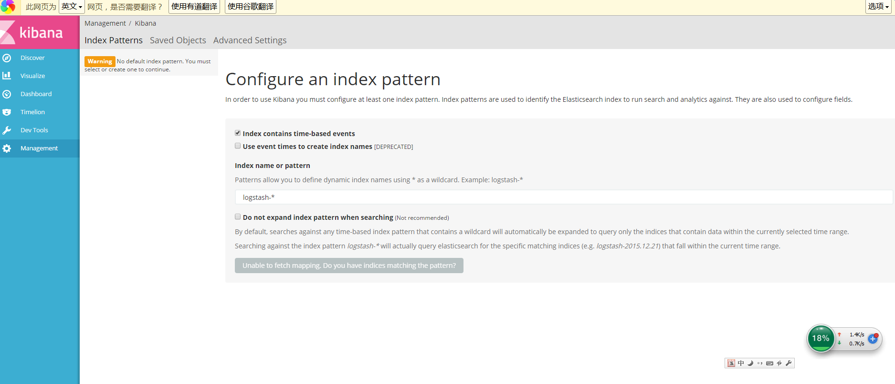

# 概述

开源实时日志分析ELK平台(ElasticSearch, Logstash, Kibana组成)，能很方便的帮我们收集日志，进行集中化的管理，并且能很方便的进行日志的统计和检索，下面基于ELK的最新版本5.2.2进行一次整合测试。

ElasticSearch是一个高可扩展的开源的全文搜索分析引擎。它允许你快速的存储、搜索和分析大量数据。ElasticSearch通常作为后端程序，为需要复杂查询的应用提供服务。

Elasticsearch是一个基于Lucene的开源分布式搜索引擎，具有分布式多用户能力。Elasticsearch是用java开发，提供Restful接口，能够达到实时搜索、高性能计算；同时Elasticsearch的横向扩展能力非常强，不需要重启服务，基本上达到了零配置。

写到一半，发现一个非常好的Logstash的文章集合，大家直接参考吧。我之后会实验为主，至于理论详解，我感觉以下三篇文章，写的比我好多好多了。

[Logstash 最佳实践](http://udn.yyuap.com/doc/logstash-best-practice-cn/index.html)

[Elasticsearch 权威指南](https://fuxiaopang.gitbooks.io/learnelasticsearch/)

[ELKstack 中文指南](https://www.gitbook.com/book/chenryn/elk-stack-guide-cn/details)

##环境要求:
+ JDK1.8
+ ElasticSearch 5.2.2

##下载地址

[https://www.elastic.co/downloads/elasticsearch](https://www.elastic.co/downloads/elasticsearch)


##安装过程


+ 1.解压ElasticSearch并进入目录：

```
chu888chu888@hadoopmaster:~$ tar xvfz elasticsearch-5.2.2.tar.gz 
```


+ 2.启动ElasticSearch

```
chu888chu888@hadoopmaster:~/elasticsearch-5.2.2$ cd bin
chu888chu888@hadoopmaster:~/elasticsearch-5.2.2/bin$ ls
chu888chu888@hadoopmaster:~/elasticsearch-5.2.2/bin$ ./elasticsearch

```

日志中启动了两个端口分别是：9300和9200,9300用于跟其他的节点的传输，9200用于接受HTTP请求，ctrl+c可以结束进程

如果想要后台运行，可以用以下方法

```
./bin/elasticsearch -d
```

+ 3. 测试ElasticSearch

```
chu888chu888@hadoopmaster:~$ curl 127.0.0.1:9200
{
  "name" : "ivu1waD",
  "cluster_name" : "elasticsearch",
  "cluster_uuid" : "J0GWcsnES6Grl2RJapiHyA",
  "version" : {
    "number" : "5.2.1",
    "build_hash" : "db0d481",
    "build_date" : "2017-02-09T22:05:32.386Z",
    "build_snapshot" : false,
    "lucene_version" : "6.4.1"
  },
  "tagline" : "You Know, for Search"
}
chu888chu888@hadoopmaster:~$ 
```

也可以使用curl尝试远程关闭

```
chu888chu888@hadoopmaster:~$ curl -XPOST 'http://localhost:9200/_shutdown'
```

+ 4. Elasticsearch配置文件

ElasticSearch的配置文件一般放置在安装目录下的config目录中。config目录中有两个文件,分别是elasticsearch.yml 和logging.yml。前者用来配置ElasticSearch不同模块的属性，比如网络地址，路径等，后者则用来配置自身的日志记录选项。

配置文件是YAML格式的，下面简要地介绍一些配置参数。


**网络地址，指定网络相关模块的绑定和发布地址**

```
network:
	host:127.0.0.1
```

**路径指定数据和日志文件的路径**

```
path:
	logs:/var/log/elasticsearch
	data:/var/data/elasticsearch
```

**集群名，指定生产集群的名字，集群将根据这个名字来自动发现和加入节点**

```
cluster:
	name:<NAME OF YOUR CLUSTER>
```

**节点名，指定每个节点的默认名称**

```
node:
	name:<NAME OF YOUR NODE>
```


因为elasticsearch安装在虚拟机里面，我希望我的主机也可以访问，需要config/elasticsearch.yml进行配置：

```
network.host: 192.168.1.159
```

重新启动后会出现错误

```
/bin$ ./elasticsearch
```

解决办法：
切换到root用户，修改配置limits.conf

```
chu888chu888@hadoopmaster:/etc/security$ sudo nano limits.conf

* soft nofile 65536
* hard nofile 131072
* soft nproc 2048
* hard nproc 4096
```

修改配置sysctl.conf

```
chu888chu888@hadoopmaster:/etc/security$ sudo nano /etc/sysctl.conf 

vm.max_map_count=655360
```

重新再启动后，成功

```
chu888chu888@hadoopmaster:~/elasticsearch-5.2.2/bin$ ./elasticsearch
[2017-03-13T15:19:11,746][INFO ][o.e.n.Node               ] [] initializing ...
[2017-03-13T15:19:11,819][INFO ][o.e.e.NodeEnvironment    ] [Vz87mNE] using [1] data paths, mounts [[/ (/dev/mapper/hadoopmaster--vg-root)]], net usable_space [40.9gb], net total_space [50.8gb], spins? [possibly], types [ext4]
[2017-03-13T15:19:11,819][INFO ][o.e.e.NodeEnvironment    ] [Vz87mNE] heap size [1.9gb], compressed ordinary object pointers [true]
[2017-03-13T15:19:11,837][INFO ][o.e.n.Node               ] node name [Vz87mNE] derived from node ID [Vz87mNE2QAmvwodx2uB94Q]; set [node.name] to override
[2017-03-13T15:19:11,839][INFO ][o.e.n.Node               ] version[5.2.2], pid[5208], build[f9d9b74/2017-02-24T17:26:45.835Z], OS[Linux/4.2.0-27-generic/amd64], JVM[Oracle Corporation/Java HotSpot(TM) 64-Bit Server VM/1.8.0_121/25.121-b13]
[2017-03-13T15:19:12,810][INFO ][o.e.p.PluginsService     ] [Vz87mNE] loaded module [aggs-matrix-stats]
[2017-03-13T15:19:12,811][INFO ][o.e.p.PluginsService     ] [Vz87mNE] loaded module [ingest-common]
[2017-03-13T15:19:12,811][INFO ][o.e.p.PluginsService     ] [Vz87mNE] loaded module [lang-expression]
[2017-03-13T15:19:12,811][INFO ][o.e.p.PluginsService     ] [Vz87mNE] loaded module [lang-groovy]
[2017-03-13T15:19:12,811][INFO ][o.e.p.PluginsService     ] [Vz87mNE] loaded module [lang-mustache]
[2017-03-13T15:19:12,812][INFO ][o.e.p.PluginsService     ] [Vz87mNE] loaded module [lang-painless]
[2017-03-13T15:19:12,812][INFO ][o.e.p.PluginsService     ] [Vz87mNE] loaded module [percolator]
[2017-03-13T15:19:12,812][INFO ][o.e.p.PluginsService     ] [Vz87mNE] loaded module [reindex]
[2017-03-13T15:19:12,812][INFO ][o.e.p.PluginsService     ] [Vz87mNE] loaded module [transport-netty3]
[2017-03-13T15:19:12,818][INFO ][o.e.p.PluginsService     ] [Vz87mNE] loaded module [transport-netty4]
[2017-03-13T15:19:12,819][INFO ][o.e.p.PluginsService     ] [Vz87mNE] loaded plugin [analysis-icu]
[2017-03-13T15:19:15,112][INFO ][o.e.n.Node               ] initialized
[2017-03-13T15:19:15,115][INFO ][o.e.n.Node               ] [Vz87mNE] starting ...
[2017-03-13T15:19:15,319][INFO ][o.e.t.TransportService   ] [Vz87mNE] publish_address {192.168.1.159:9300}, bound_addresses {192.168.1.159:9300}
[2017-03-13T15:19:15,322][INFO ][o.e.b.BootstrapChecks    ] [Vz87mNE] bound or publishing to a non-loopback or non-link-local address, enforcing bootstrap checks
[2017-03-13T15:19:18,386][INFO ][o.e.c.s.ClusterService   ] [Vz87mNE] new_master {Vz87mNE}{Vz87mNE2QAmvwodx2uB94Q}{q1ibuBcJQDOjdyySwkrHOw}{192.168.1.159}{192.168.1.159:9300}, reason: zen-disco-elected-as-master ([0] nodes joined)
[2017-03-13T15:19:18,424][INFO ][o.e.h.HttpServer         ] [Vz87mNE] publish_address {192.168.1.159:9200}, bound_addresses {192.168.1.159:9200}
[2017-03-13T15:19:18,424][INFO ][o.e.n.Node               ] [Vz87mNE] started
[2017-03-13T15:19:18,995][INFO ][o.e.g.GatewayService     ] [Vz87mNE] recovered [2] indices into cluster_state
[2017-03-13T15:19:19,255][INFO ][o.e.c.r.a.AllocationService] [Vz87mNE] Cluster health status changed from [RED] to [YELLOW] (reason: [shards started [[.kibana][0]] ...]).


```


##ElasticSearch插件
ElasticSearch有各种插件，可以简化诸如管理索引、集群等任务。其中一些常用的插件有kopf Marvel Sense Shield等等。


##ElasticSearch安装错误FAQ

Elasticsearch5.0 安装问题集锦

elasticsearch 5.0 安装过程中遇到了一些问题，通过查找资料几乎都解决掉了，这里简单记录一下 ，供以后查阅参考，也希望可以帮助遇到同样问题的你。

+ 1.问题一：警告提示

```
[2016-11-06T16:27:21,712][WARN ][o.e.b.JNANatives ] unable to install syscall filter: 

java.lang.UnsupportedOperationException: seccomp unavailable: requires kernel 3.5+ with CONFIG_SECCOMP and CONFIG_SECCOMP_FILTER compiled in
at org.elasticsearch.bootstrap.Seccomp.linuxImpl(Seccomp.java:349) ~[elasticsearch-5.0.0.jar:5.0.0]
at org.elasticsearch.bootstrap.Seccomp.init(Seccomp.java:630) ~[elasticsearch-5.0.0.jar:5.0.0]

报了一大串错误，其实只是一个警告。

解决：使用比较新的linux版本，就不会出现此类问题了。
```


+ 2.问题二：ERROR: bootstrap checks failed

```

max file descriptors [4096] for elasticsearch process likely too low, increase to at least [65536]
max number of threads [1024] for user [lishang] likely too low, increase to at least [2048]

解决：切换到root用户，编辑limits.conf 添加类似如下内容

vi /etc/security/limits.conf 

添加如下内容:

* soft nofile 65536

* hard nofile 131072

* soft nproc 2048

* hard nproc 4096
```


+ 3.问题三：max number of threads [1024] for user [lish] likely too low, increase to at least [2048]

```

解决：切换到root用户，进入limits.d目录下修改配置文件。

vi /etc/security/limits.d/90-nproc.conf 

修改如下内容：

* soft nproc 2048
```


+ 4.问题四：max virtual memory areas vm.max_map_count [65530] likely too low, increase to at least [262144]

```

解决：切换到root用户修改配置sysctl.conf

vi /etc/sysctl.conf 

添加下面配置：

vm.max_map_count=655360

并执行命令：

sysctl -p

然后，重新启动elasticsearch，即可启动成功。
```


##LogStash
Logstash是一个完全开源的工具，可以对你的日志进行收集、过滤，并将其存储供以后使用，参考官网的介绍图：


写到一半，发现一个非常好的Logstash的文章集合，大家直接参考吧。

[Logstash 最佳实践](http://udn.yyuap.com/doc/logstash-best-practice-cn/index.html)

[Elasticsearch 权威指南](https://fuxiaopang.gitbooks.io/learnelasticsearch/)

[ELKstack 中文指南](https://www.gitbook.com/book/chenryn/elk-stack-guide-cn/details)


###安装

+ 1.解压进入目录

```
chu888chu888@hadoopmaster:~$ unzip logstash-5.2.2.zip
```

+ 2.添加配置文件

```
chu888chu888@hadoopmaster:~/logstash-5.2.2/config$ nano logstash.conf

```

+ 3.添加如下内容

我们通过一个股票的例子（从yahoo下载下来的数据），来讲解通过logstash导入数据到elasticsearch中,http://finance.yahoo.com/q/hp?s=GOOG

这个数据集中最重要的字段包括 date(日期) open price(开盘价格) close price(收盘价格) high price(最高价) volume(成交量) adjusted price(调整价格)

```
Date,Open,High,Low,Close,Volume,Adj Close
2017-03-10,843.280029,844.909973,839.50,843.25,1701100,843.25
2017-03-09,836.00,842.00,834.210022,838.679993,1259900,838.679993
2017-03-08,833.51001,838.150024,831.789978,835.369995,988700,835.369995
2017-03-07,827.400024,833.409973,826.52002,831.909973,1016600,831.909973
2017-03-06,826.950012,828.880005,822.400024,827.780029,1105800,827.780029
2017-03-03,830.559998,831.359985,825.750977,829.080017,888900,829.080017
2017-03-02,833.849976,834.51001,829.640015,830.630005,937700,830.630005
2017-03-01,828.849976,836.255005,827.26001,835.23999,1491400,835.23999
2017-02-28,825.609985,828.539978,820.200012,823.210022,2252300,823.210022
2017-02-27,824.549988,830.50,824.00,829.280029,1099500,829.280029
2017-02-24,827.72998,829.00,824.200012,828.640015,1386600,828.640015
2017-02-23,830.119995,832.460022,822.880005,831.330017,1470100,831.330017
2017-02-22,828.659973,833.25,828.640015,830.76001,982900,830.76001
2017-02-21,828.659973,833.450012,828.349976,831.659973,1247700,831.659973
2017-02-17,823.02002,828.070007,821.655029,828.070007,1597800,828.070007
2017-02-16,819.929993,824.400024,818.97998,824.159973,1281700,824.159973

```

每行代表了某一天的股票价格，字段之间以逗号分割.

```
input
{
	file
	{
		path=>"/home/chu888chu888/table.csv"
		start_position=>"beginning"
	}
}

filter
{
	csv
	{
		columns=>["date_of_record","open","high","low","close","volume","adj_close"]
		separator=>","
	}
	date
	{
		match=>["date_of_record","yyyy-MM-dd"]
	}
	mutate
	{
		convert=>["open","float"]
		convert=>["high","float"]
		convert=>["low","float"]
		convert=>["close","float"]
		convert=>["volume","integer"]
		convert=>["adj_close","float"]
	}
}

output
{
	elasticsearch
	{
		 hosts => [ "192.168.1.159:9200" ]
	}
}
```

+ 4.启动服务

```
chu888chu888@hadoopmaster:~/logstash-5.2.2/bin$ ./logstash -f /home/chu888chu888/logstash.conf

```

+ 5.启动成功后的日志

```
chu888chu888@hadoopmaster:~/logstash-5.2.2/bin$ ./logstash -f /home/chu888chu888/logstash.conf
Sending Logstash's logs to /home/chu888chu888/logstash-5.2.2/logs which is now configured via log4j2.properties
[2017-03-13T15:25:37,977][INFO ][logstash.outputs.elasticsearch] Elasticsearch pool URLs updated {:changes=>{:removed=>[], :added=>[http://192.168.1.159:9200/]}}
[2017-03-13T15:25:37,979][INFO ][logstash.outputs.elasticsearch] Running health check to see if an Elasticsearch connection is working {:healthcheck_url=>http://192.168.1.159:9200/, :path=>"/"}
[2017-03-13T15:25:38,173][WARN ][logstash.outputs.elasticsearch] Restored connection to ES instance {:url=>#<URI::HTTP:0x63e64c30 URL:http://192.168.1.159:9200/>}
[2017-03-13T15:25:38,178][INFO ][logstash.outputs.elasticsearch] Using mapping template from {:path=>nil}
[2017-03-13T15:25:38,288][INFO ][logstash.outputs.elasticsearch] Attempting to install template {:manage_template=>{"template"=>"logstash-*", "version"=>50001, "settings"=>{"index.refresh_interval"=>"5s"}, "mappings"=>{"_default_"=>{"_all"=>{"enabled"=>true, "norms"=>false}, "dynamic_templates"=>[{"message_field"=>{"path_match"=>"message", "match_mapping_type"=>"string", "mapping"=>{"type"=>"text", "norms"=>false}}}, {"string_fields"=>{"match"=>"*", "match_mapping_type"=>"string", "mapping"=>{"type"=>"text", "norms"=>false, "fields"=>{"keyword"=>{"type"=>"keyword"}}}}}], "properties"=>{"@timestamp"=>{"type"=>"date", "include_in_all"=>false}, "@version"=>{"type"=>"keyword", "include_in_all"=>false}, "geoip"=>{"dynamic"=>true, "properties"=>{"ip"=>{"type"=>"ip"}, "location"=>{"type"=>"geo_point"}, "latitude"=>{"type"=>"half_float"}, "longitude"=>{"type"=>"half_float"}}}}}}}}
[2017-03-13T15:25:38,315][INFO ][logstash.outputs.elasticsearch] New Elasticsearch output {:class=>"LogStash::Outputs::ElasticSearch", :hosts=>[#<URI::Generic:0x2fc46ddb URL://192.168.1.159:9200>]}
[2017-03-13T15:25:38,316][INFO ][logstash.pipeline        ] Starting pipeline {"id"=>"main", "pipeline.workers"=>1, "pipeline.batch.size"=>125, "pipeline.batch.delay"=>5, "pipeline.max_inflight"=>125}
[2017-03-13T15:25:38,646][INFO ][logstash.pipeline        ] Pipeline main started
[2017-03-13T15:25:38,742][INFO ][logstash.agent           ] Successfully started Logstash API endpoint {:port=>9600}

```


##Kibana
Kibana可以为Logstash和ElasticSearch提供的日志分析友好的Web界面，可以帮助您汇总、分析和搜索重要数据日志。

1.解压进入目录

```
chu888chu888@hadoopmaster:~$ tar xvfz kibana-5.2.2-linux-x86_64.tar.gz
```
2.修改配置文件

```
nano config/kibana.yml
```
3.添加如下配置项

```
server.port: 5601
server.host: "192.168.1.159"
elasticsearch.url: "http://192.168.1.159:9200"
kibana.index: ".kibana"
```
4.启动服务

```
./bin/kibana
```
5.启动成功日志如下

```
chu888chu888@hadoopmaster:~/kibana-5.2.2-linux-x86_64/bin$ ./kibana
 
```
6.浏览器访问

默认第一次需要Configure an index pattern，默认的Index name是logstash-*，直接create就行了。

```
http://192.168.1.159:5601/app/kibana#/management/kibana/index/?_g=()
```



