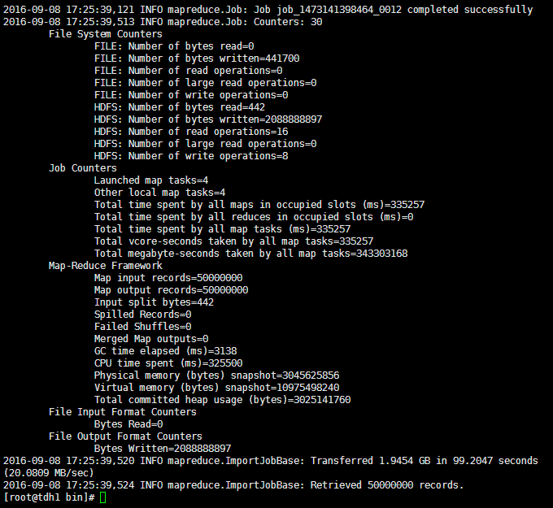
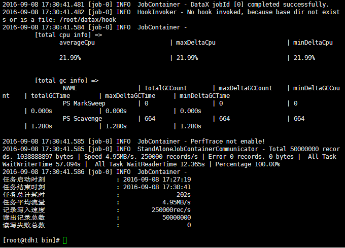
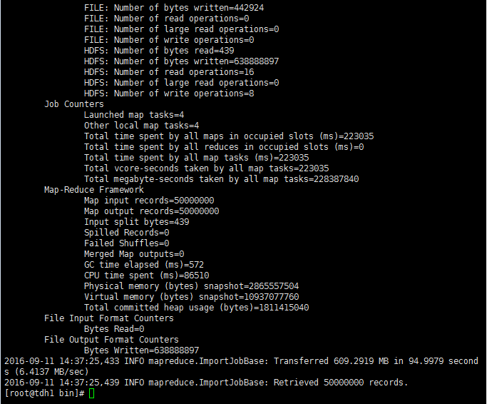
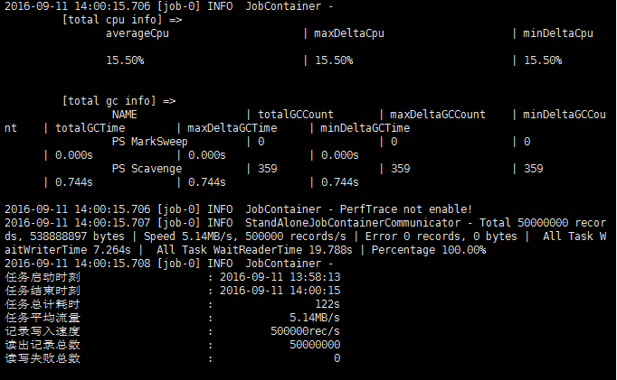

##sqoop主要特点
1、可以将关系型数据库中的数据导入hdfs、hive或者hbase等hadoop组件中，也可将hadoop组件中的数据导入到关系型数据库中；

2、sqoop在导入导出数据时，充分采用了map-reduce计算框架，根据输入条件生成一个map-reduce作业，在hadoop集群中运行。采用map-reduce框架同时在多个节点进行import或者export操作，
速度比单节点运行多个并行导入导出效率高，同时提供了良好的并发性和容错性；

3、支持insert、update模式，可以选择参数，若内容存在就更新，若不存在就插入；

4、对国外的主流关系型数据库支持性更好。

##datax主要特点：
1、异构数据库和文件系统之间的数据交换；

2、采用Framework + plugin架构构建，Framework处理了缓冲，流控，并发，上下文加载等高速数据交换的大部分技术问题，提供了简单的接口与插件交互，
插件仅需实现对数据处理系统的访问；

3、数据传输过程在单进程内完成，全内存操作，不读写磁盘，也没有IPC；

4、开放式的框架，开发者可以在极短的时间开发一个新插件以快速支持新的数据库/文件系统。

##sqoop和datax的区别：
1、sqoop采用map-reduce计算框架进行导入导出，而datax仅仅在运行datax的单台机器上进行数据的抽取和加载，速度比sqoop慢了许多；

2、sqoop只可以在关系型数据库和hadoop组件之间进行数据迁移，而在hadoop相关组件之间，比如hive和hbase之间就无法使用sqoop互相导入导出数据，
同时在关系型数据库之间，比如mysql和oracle之间也无法通过sqoop导入导出数据。与之相反，datax能够分别实现关系型数据库和hadoop组件之间、关系型数据库
之间、hadoop组件之间的数据迁移；

3、sqoop是专门为hadoop而生，对hadoop支持度好，而datax可能会出现不支持高版本hadoop的现象；

4、sqoop只支持官方提供的指定几种关系型数据库和hadoop组件之间的数据交换，而在datax中，用户只需根据自身需求修改文件，生成相应rpm包，自行安装之后就可以使用自己定制的插件；

##性能比较
###1、mysql->hdfs

在mysql中生成50,000,000条数据，将这些数据分别使用datax和sqoop导入到hdfs中，分别比较它们的性能参数：

sqoop:
<table>
<tr>
<th>属性</th>
<th>值</th>
</tr>
<tr>
<td>CPU时间(ms)</td>
<td>325500</td>
</tr>
<tr>
<td>读取物理内存快照大小(byte)</td>
<td>3045625856</td>
</tr>
<tr>
<td>读取虚拟内存快照大小(byte)</td>
<td>10975498240</td>
</tr>
<tr>
<td>平均速率(MB/s)</td>
<td>20.0809</td>
</tr>
<tr>
<td>总时间(s)</td>
<td>99.2047</td>
</tr>
</table>

datax:
<table>
<tr>
<th>属性</th>
<th>值</th>
</tr>
<tr>
<td>CPU平均占用率(%)</td>
<td>21.99</td>
</tr>
<tr>
<td>平均速率(MB/s)</td>
<td>4.95</td>
</tr>
<tr>
<td>总时间(s)</td>
<td>202</td>
</tr>
</table>

###2、oracle->hdfs

在oracle中生成50,000,000条数据，将这些数据分别使用datax和sqoop导入到hdfs中，分别比较它们的性能参数：

sqoop：
<table>
<tr>
<th>属性</th>
<th>值</th>
</tr>
<tr>
<td>CPU时间</td>
<td>86510毫秒</td>
</tr>
<tr>
<td>读取物理内存快照大小</td>
<td>2865557504</td>
</tr>
<tr>
<td>读取虚拟内存快照大小</td>
<td>10937077760</td>
</tr>
<tr>
<td>平均速率</td>
<td>6.4137MB/s</td>
</tr>
<tr>
<td>总时间</td>
<td>94.9979s</td>
</tr>
</table>

datax:
<table>
<tr>
<th>属性</th>
<th>值</th>
</tr>
<tr>
<td>CPU平均占用率</td>
<td>15.50%</td>
</tr>
<tr>
<td>平均速率</td>
<td>5.14MB/s</td>
</tr>
<tr>
<td>总时间</td>
<td>122s</td>
</tr>
</table>

##与TDH的兼容性
1、与TDH中的hadoop版本兼容，能够将关系型数据库中数据导入TDH中的hdfs中；

2、datax拥有一个sqoop没有的功能，就是将数据从hdfs导入到hbase，但是该功能目前仅仅支持的hbase版本为：0.94.x和1.1.x两个。而TDH中hyperbase的hbase版本为0.98.6，所以也不支持TDH的Hyperbase。