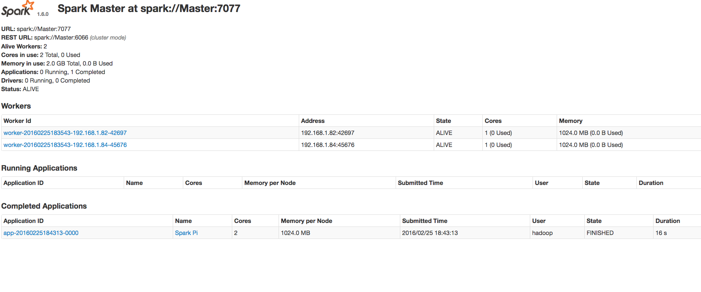

# 安装

##基于YARN的部署方案

###1. 软件环境：

```
Ubuntu 14.04.1 LTS (GNU/Linux 3.13.0-32-generic x86_64)
Hadoop: 2.6.0
Spark: 1.6.0
```

###2. 环境准备

**修改主机名**

我们将搭建1个Master，2个Slave的集群方案。首先修改主机名nano /etc/hostname，在Master上修改为Master，其中一个Slave上修改为Slave1，另一个同理。

**配置hosts**

在每台主机上修改host文件

```
nano /etc/hosts

192.168.1.80      Master
192.168.1.82      Slave1
192.168.1.84      Slave2
```
配置之后ping一下用户名看是否生效

```
ping Slave1
ping Slave2

```

###3. SSH 免密码登录

**安装Openssh server**

```sudo apt-get install openssh-server```

**在所有机器上都生成私钥和公钥**

```ssh-keygen -t rsa   #一路回车```

需要让机器间都能相互访问，就把每个机子上的id_rsa.pub发给Master节点，传输公钥可以用scp来传输。

```scp ~/.ssh/id_rsa.pub spark@Master:~/.ssh/id_rsa.pub.Slave1```

在Master上，将所有公钥加到用于认证的公钥文件authorized_keys中

```cat ~/.ssh/id_rsa.pub* >> ~/.ssh/authorized_keys```

将公钥文件authorized_keys分发给每台Slave

```scp ~/.ssh/authorized_keys spark@Master:~/.ssh/```

在每台机子上验证SSH无密码通信

```
ssh Master
ssh Slave1
ssh Slave2
```

如果登陆测试不成功，则可能需要修改文件authorized_keys的权限（权限的设置非常重要，因为不安全的设置安全设置,会让你不能使用RSA功能 ）

```chmod 600 ~/.ssh/authorized_keys```

###4.安装 Java
从官网下载最新版 Java 就可以，Spark官方说明 Java 只要是6以上的版本都可以，我下的是 jdk-7u75-linux-x64.gz在~/workspace目录下直接解压

```tar -zxvf jdk-7u75-linux-x64.gz```

修改环境变量sudo vi /etc/profile，添加下列内容，注意将home路径替换成你的：

```
export JAVA_HOME=/usr/lib/jvm/
export JRE_HOME=${JAVA_HOME}/jre
export CLASSPATH=.:${JAVA_HOME}/lib:${JRE_HOME}/lib:/usr/local/hive/lib
export PATH=${JAVA_HOME}/bin:$PATH

#HADOOP VARIABLES START
export JAVA_HOME=/usr/lib/jvm/
export HADOOP_INSTALL=/usr/local/hadoop
export PATH=$PATH:$HADOOP_INSTALL/bin
export PATH=$PATH:$JAVA_HOME/bin
export PATH=$PATH:$HADOOP_INSTALL/sbin
export HADOOP_MAPRED_HOME=$HADOOP_INSTALL
export HADOOP_COMMON_HOME=$HADOOP_INSTALL
export HADOOP_HDFS_HOME=$HADOOP_INSTALL
export YARN_HOME=$HADOOP_INSTALL
export HADOOP_COMMON_LIB_NATIVE_DIR=$HADOOP_INSTALL/lib/native
export HADOOP_OPTS="-Djava.library.path=$HADOOP_INSTALL/lib"
#HADOOP VARIABLES END


export HIVE_HOME=/usr/local/hive
export PATH=$PATH:$HIVE_HOME/bin:/usr/local/hbase/bin

export JAVA_LIBRARY_PATH=/usr/local/hadoop/lib/native

export SCALA_HOME=/usr/lib/scala
export PATH=$PATH:$SCALA_HOME/bin

```

然后使环境变量生效，并验证 Java 是否安装成功

```
$ source /etc/profile   #生效环境变量
$ java -version         #如果打印出如下版本信息，则说明安装成功
java version "1.7.0_75"
Java(TM) SE Runtime Environment (build 1.7.0_75-b13)
Java HotSpot(TM) 64-Bit Server VM (build 24.75-b04, mixed mode)
```


###5.安装 Scala
Spark官方要求 Scala 版本为 2.10.x，注意不要下错版本，我这里下了 2.10.6

```
tar -zxvf scala-2.10.4.tgz
再次修改环境变量sudo vi /etc/profile，添加以下内容：

export SCALA_HOME=/usr/lib/scala
export PATH=$PATH:$SCALA_HOME/bin
同样的方法使环境变量生效，并验证 scala 是否安装成功

$ source /etc/profile   #生效环境变量
$ scala -version        #如果打印出如下版本信息，则说明安装成功
Scala code runner version 2.10.6 -- Copyright 2002-2013, LAMP/EPFL
```


###6.安装配置 Hadoop YARN
此处参考以前的安装过程

###7.Spark安装

下载解压进入官方下载地址下载最新版 Spark。我下载的是 spark-1.6.0-bin-hadoop2.6.tgz。

```
tar -zxvf spark-1.6.0-bin-hadoop2.6.tgz
mv spark-1.6.0-bin-hadoop2.4 /usr/local/spark

配置 Spark

chmod -R 775 /usr/local/spark
chown -R hadoop:hadoop /usr/local/spark
cd /usr/local/spark/conf    #进入spark配置目录
cp spark-env.sh.template spark-env.sh   #从配置模板复制
vi spark-env.sh     #添加配置内容

export SCALA_HOME=/usr/lib/scala
export JAVA_HOME=/usr/lib/jvm/
export HADOOP_HOME=/usr/local/hadoop
export HADOOP_CONF_DIR=$HADOOP_HOME/etc/hadoop
SPARK_MASTER_IP=Master
SPARK_LOCAL_DIRS=/usr/local/spark
SPARK_DRIVER_MEMORY=1G
```

注：在设置Worker进程的CPU个数和内存大小，要注意机器的实际硬件条件，如果配置的超过当前Worker节点的硬件条件，Worker进程会启动失败。

```
nano Slaves在slaves文件下填上Slave主机名：

Slave1
Slave2
将配置好的spark-1.6.0文件夹分发给所有Slaves吧

启动Spark

sbin/start-all.sh
验证 Spark 是否安装成功

用jps检查，在 master 上应该有以下几个进程：

$ jps
7949 Jps
7328 SecondaryNameNode
7805 Master
7137 NameNode
7475 ResourceManager
在 slave 上应该有以下几个进程：

$jps
3132 DataNode
3759 Worker
3858 Jps
3231 NodeManager
进入Spark的Web管理页面： http://192.168.1.80:8080
```


###8.运行示例

**本地模式两线程运行**

./bin/run-example SparkPi 10 --master local[2]

**Spark Standalone 集群模式运行**

```
./spark-submit --class org.apache.spark.examples.SparkPi --master spark://Master:7077 /usr/local/spark/lib/spark-examples-1.6.0-hadoop2.6.0.jar 100
```

**Spark on YARN 集群上 yarn-cluster 模式运行**

```
./spark-submit --class org.apache.spark.examples.SparkPi --master yarn-cluster /usr/local/spark/lib/spark-examples-1.6.0-hadoop2.6.0.jar 10
```

注意 Spark on YARN 支持两种运行模式，分别为yarn-cluster和yarn-client，具体的区别可以看这篇博文，从广义上讲，yarn-cluster适用于生产环境；而yarn-client适用于交互和调试，也就是希望快速地看到application的输出。


