#离线安装Cloudera Manager 5和CDH5(5.2.3)

CDH (Cloudera's Distribution, including Apache Hadoop)，是Hadoop众多分支中的一种，由Cloudera维护，基于稳定版本的Apache Hadoop构建，并集成了很多补丁，可直接用于生产环境。

Cloudera Manager则是为了便于在集群中进行Hadoop等大数据处理相关的服务安装和监控管理的组件，对集群中主机、Hadoop、Hive、Spark等服务的安装配置管理做了极大简化。

##一 系统环境  
* 实验环境：Mac下VMware虚拟机  
* 操作系统：CentOS 6.5 x64 (至少内存2G以上，这里内存不够的同学建议还是整几台真机配置比较好，将CDH的所有组件全部安装会占用很多内存，我已开始设置的虚拟机内存是1G，安装过程中直接卡死了)  
* Cloudera Manager：5.2.3  
* CDH: 5.2.3  

##二 安装说明  
###1 官方参考文档：  

官方安装文档:[地址](http://www.cloudera.com/content/cloudera/en/documentation/cloudera-manager/v5-latest/Cloudera-Manager-Installation-Guide/cm5ig_install_path_C.html)

官方共给出了3中安装方式：

第一种方法必须要求所有机器都能连网，由于最近各种国外的网站被墙的厉害，我尝试了几次各种超时错误，巨耽误时间不说，一旦失败，重装非常痛苦。

第二种方法下载很多包。

第三种方法对系统侵入性最小,最大优点可实现全离线安装，而且重装什么的都非常方便。后期的集群统一包升级也非常好。这也是我之所以选择离线安装的原因。  

###2 Cloudera Manager下载地址：

[下载地址](http://archive.cloudera.com/cm5/cm/5/cloudera-manager-el6-cm5.1.3_x86_64.tar.gz )

###3 Cloudera Manager安装要求信息：

[浏览地址](http://www.cloudera.com/content/cloudera/en/documentation/cloudera-manager/v5-latest/Cloudera-Manager-Version-and-Download-Information/Cloudera-Manager-Version-and-Download-Information.html#cmvd_topic_1  )

###4 CDH安装包下载地址：  
 http://archive.cloudera.com/cdh5/parcels/latest/ ，  
由于我们的操作系统为CentOS6.5，需要下载以下文件：

CDH-5.1.3-1.cdh5.1.3.p0.12-el6.parcel  
CDH-5.1.3-1.cdh5.1.3.p0.12-el6.parcel.sha1  
manifest.json  
###5 注意 ：  
与CDH4的不同，原来安装CDH4的时候还需要下载IMPALA、Cloudera Search(SOLR)，CDH5中将他们包含在一起了，所以只需要下载一个CDH5的包就可以了。  
而在咱们公司内部可以在内部的ftp服务器（192.168.1.110）都能找到所需要的文件，在下面我将会把这些文件的拷贝方法一同写入到里面。  
##三 准备工作：系统环境搭建  
以下操作均用root用户操作。  
###1. 网络配置(所有节点)  
`vi /etc/sysconfig/network` 
修改hostname：  

```
NETWORKING=yes
HOSTNAME=dhc-4
```

通过 `service network restart` 重启网络服务生效。  
`vi /etc/hosts` ,修改ip与主机名的对应关系

```
192.168.1.213   dhc-4
192.168.1.214   dhc-5
192.168.1.215   dhc-6  
```
###2 注意：   
这里需要将每台机器的ip及主机名对应关系都写进去，本机的也要写进去，否则启动Agent的时候会提示hostname解析错误。
##四 打通SSH，设置ssh无密码登陆（所有节点）  
在所有节点上执行 ssh-keygen -t rsa 一路回车，生成无密码的密钥对。  

将主节点公钥添加到认证文件中： `cat ~/.ssh/id_rsa.pub >> ~/.ssh/authorized_keys` ，并设置authorized_keys的访问权限： `chmod 600 ~/.ssh/authorized_keys `。  
分别使用以下命令scp文件到所有datenode节点：  

```
scp ~/.ssh/authorized_keys root@dhc-5:~/.ssh/
scp ~/.ssh/authorized_keys root@dhc-6:~/.ssh/
```
###1 测试：  
在主节点上ssh n2，正常情况下，不需要密码就能直接登陆进去了。

##五.安装Oracle的Java（所有节点）  
CentOS，自带OpenJdk，不过运行CDH5需要使用Oracle的Jdk，需要Java 7的支持。

卸载自带的OpenJdk，使用 rpm -qa | grep java 查询java相关的包，使用 rpm -e --nodeps 包名 卸载之。

去Oracle的官网下载jdk的rpm安装包，并使用 rpm -ivh 包名 安装之。  
而咱们公司中的jdk1.7放在：  

```
/home/hadoop/Hadoop/CDH/CDHCentOS6/jdk-7u80-linux-x64.rpm 
```
可以使用命令  

`scp hadoop@192.168.1.110:/home/hadoop/Hadoop/CDH/CDHCentOS6/jdk-7u80-linux-x64.rpm /usr/local`  将jdk1.7放在/usr/local目录下，然后进入到此目录下，使用命令  `rpm -ivh  jdk-7u80-linux-x64.rpm`  安装jdk1.7。  
由于是rpm包并不需要我们来配置环境变量，我们只需要配置一个全局的JAVA_HOME变量即可，执行命令：  

```
echo "JAVA_HOME=/usr/java/latest/" >> /etc/environment
```
##六.安装配置MySql（主节点） 
 
在安装mysql数据库之前，先使用命令

查看：`rpm -qa | grep mysql`

卸载：`rpm -e --nodeps mysql-libs-5.1.71-1.el6.x86_64`

将本机自带的mysql数据库卸载。

在线安装可以通过 yum install mysql-server 本例中，在本地ftp服务器上下载了一个MySQL的安装包，可以使用命令：  

```
scp hadoop@192.168.1.110:/home/hadoop/Hadoop/CDH/CDHCentOS6/MySQL-5.5.49-1.el6.x86_64.rpm-bundle.tar /usr/local
```
将MySQL的安装包放在/usr/local/目录下，进入到此目录下，执行命令：

`tar -xvf  MySQL-5.5.49-1.el6.x86_64.rpm-bundle.tar`  

进行解压，解压完成之后会出现几个以.rpm为结尾的安装包，我们只需要安装MySQL-server和MySQL-client这两个包即可，可以使用命令：`rpm -ivh +包名` 即可安装。  
安装完成以后使用命令`service mysql start`打开MySQL服务，并根据提示设置root的初试密码： 

`mysqladmin -u root password 'xxxx'` 。  

`mysql -uroot -p123456 `进入mysql命令行，创建以下数据库：

```
#hive  
create database hive DEFAULT CHARSET utf8 COLLATE utf8_general_ci;  
#activity monitor  
create database amon DEFAULT CHARSET utf8 COLLATE utf8_general_ci; 
```
设置root授权访问以上所有的数据库：

```
#授权root用户在主节点拥有所有数据库的访问权限
#grant all privileges on *.* to 'root'@'dhc-4' identified by '123456' with grant option;
#flush privileges;
```
###官方MySql配置文档： 
http://www.cloudera.com/content/cloudera/en/documentation/cloudera-manager/v5-latest/Cloudera-Manager-Installation-Guide/cm5ig_mysql.html#cmig_topic_5_5  
##七.关闭防火墙和SELinux  
###注意： 
需要在所有的节点上执行，因为涉及到的端口太多了，临时关闭防火墙是为了安装起来更方便，安装完毕后可以根据需要设置防火墙策略，保证集群安全。  
关闭防火墙：  

```
service iptables stop （临时关闭）  
chkconfig iptables off （重启后生效）

```
关闭SELINUX（实际安装过程中发现没有关闭也是可以的，不知道会不会有问题，还需进一步进行验证）:

```
setenforce 0 （临时生效）  
修改 /etc/selinux/config 下的 SELINUX=disabled （重启后永久生效） 
```
 
##八.所有节点配置NTP服务（参照:补充说明1）  
集群中所有主机必须保持时间同步，如果时间相差较大会引起各种问题。 具体思路如下：

master节点作为ntp服务器与外界对时中心同步时间，随后对所有datanode节点提供时间同步服务。

所有datanode节点以master节点为基础同步时间。

所有节点安装相关组件： `yum install ntp` 。完成后，配置开机启动： `chkconfig ntpd on` ,检查是否设置成功： `chkconfig --list ntpd` 其中2-5为on状态就代表成功。  
###1 主节点配置  
在配置之前，先使用ntpdate手动同步一下时间，免得本机与对时中心时间差距太大，使得ntpd不能正常同步。这里选用65.55.56.206作为对时中心, `ntpdate -u 65.55.56.206` 。

ntp服务只有一个配置文件，配置好了就OK。 这里只给出有用的配置，不需要的配置都用#注掉，这里就不在给出：

```
driftfile /var/lib/ntp/drift
restrict 127.0.0.1
restrict -6 ::1
restrict default nomodify notrap 
server 65.55.56.206 prefer
includefile /etc/ntp/crypto/pw
keys /etc/ntp/keys 
```
 
配置文件完成，保存退出，启动服务，执行如下命令： `service ntpd start`

检查是否成功，用ntpstat命令查看同步状态，出现以下状态代表启动成功：  

```
synchronised to NTP server () at stratum 2
time correct to within 74 ms
polling server every 128 s  
```

如果出现异常请等待几分钟，一般等待5-10分钟才能同步。
###2 配置ntp客户端（所有datanode节点）  

```
driftfile /var/lib/ntp/drift
restrict 127.0.0.1
restrict -6 ::1
restrict default kod nomodify notrap nopeer noquery
restrict -6 default kod nomodify notrap nopeer noquery
#这里是主节点的主机名或者ip
server n1
includefile /etc/ntp/crypto/pw
keys /etc/ntp/keys
```

ok保存退出，请求服务器前，请先使用ntpdate手动同步一下时间： ntpdate -u n1 (主节点ntp服务器)

这里可能出现同步失败的情况，请不要着急，一般是本地的ntp服务器还没有正常启动，一般需要等待5-10分钟才可以正常同步。启动服务： `service ntpd start`

因为是连接内网，这次启动等待的时间会比master节点快一些，但是也需要耐心等待一会儿。  

**补充说明1:**由于咱们使用的服务器没有联网，因此这一步可省略，但是你要检查一下你的三台主机之间的时间是否差异太大，如果太大将会对下面的安装造成不必要的麻烦，可以用`date`命令查看当前主机的时间，然后如果发现差异太大的话，使用命令：`date -s + 时间点（主节点上面的时间点）`进行时间同步。  
##九 安装Cloudera Manager Server 和Agent

###1 主节点解压安装
咱们公司内部的Cloudera manager存放在ftp服务器上，可以使用命令：  

```
scp hadoop@192.168.1.110:/home/hadoop/Hadoop/CDH/CDHCentOS6/cdh5.3.2/cloudera-manager-el6-cm5.3.2_x86_64.tar.gz /opt
```
cloudera manager的目录默认位置在/opt下，解压： `tar xzvf cloudera-manager*.tar.gz `将解压后的cm-5.2.3和cloudera目录放到/opt目录下。  
###2 为Cloudera Manager 5建立数据库  
首先需要去MySql的官网下载JDBC驱动， http://dev.mysql.com/downloads/connector/j/ ，解压后，找到mysql-connector-java-5.1.33-bin.jar，放到/opt/cm-5.1.3/share/cmf/lib/中。  
本公司内部可以使用命令：  

```
scp hadoop@192.168.1.110:/home/hadoop/Hadoop/CDH/CDHCentOS6/mysql-connector-java-5.1.36.tar.gz /usr/local 
```

将数据库的JDBC驱动放在/usr/local/目录下，进入到此目录下，进行解压：`tar -zxvf mysql-connector-java-5.1.36.tar.gz`。解压后，找到mysql-connector-java-5.1.36-bin.jar，放到/opt/cm-5.3.2/share/cmf/lib/中。  
在主节点初始化CM5的数据库：  

```
/opt/cm-5.3.2/share/cmf/schema/scm_prepare_database.sh mysql cm -hlocalhost -uroot -p123456 --scm-host localhost scm scm scm
```

##十 Agent配置  
修改/opt/cm-5.3.2/etc/cloudera-scm-agent/config.ini中的server_host为主节点的主机名。  
###1 同步Agent到其他节点

```
scp -r /opt/cm-5.3.2 root@dhc-5:/opt/
scp -r /opt/cm-5.3.2 root@dhc-6:/opt/
```

###2 在所有节点创建cloudera-scm用户  

```
useradd --system --home=/opt/cm-5.3.2/run/cloudera-scm-server/ --no-create-home --shell=/bin/false --comment "Cloudera SCM User" cloudera-scm
```

###3 准备Parcels，用以安装CDH5  
将CHD5相关的Parcel包放到主节点的/opt/cloudera/parcel-repo/目录中，相关的文件如下：

```
CDH-5.1.3-1.cdh5.1.3.p0.12-el6.parcel
CDH-5.1.3-1.cdh5.1.3.p0.12-el6.parcel.sha1
manifest.json
```
本公司内部的这些文件可以使用命令：

```
scp hadoop@192.168.1.110:/home/hadoop/Hadoop/CDH/CDHCentOS6/cdh5.3.2/CDH-5.3.2-1.cdh5.3.2.p0.10-el6.parcel /opt/cloudera/parcel-repo/ 
	
scp hadoop@192.168.1.110:/home/hadoop/Hadoop/CDH/CDHCentOS6/cdh5.3.2/CDH-5.3.2-1.cdh5.3.2.p0.10-el6.parcel.sha1 /opt/cloudera/parcel-repo/

scp hadoop@192.168.1.110:/home/hadoop/Hadoop/CDH/CDHCentOS6/cdh5.3.2/manifest.json /opt/cloudera/parcel-repo/
```
最后将CDH-5.1.3-1.cdh5.1.3.p0.12-el6.parcel.sha1，重命名为CDH-5.1.3-1.cdh5.1.3.p0.12-el6.parcel.sha，这点必须注意，否则，系统会重新下载CDH-5.1.3-1.cdh5.1.3.p0.12-el6.parcel文件。  
###4 相关启动脚本
通过 `/opt/cm-5.3.2/etc/init.d/cloudera-scm-server start` 启动服务端。（只需主节点启动这项服务即可）

通过 `/opt/cm-5.3.2/etc/init.d/cloudera-scm-agent start` 启动Agent服务。（每个节点都要启动这项服务）  
我们启动的其实是个service脚本，需要停止服务将以上的start参数改为stop就可以了，重启是restart。
##十一 CDH5的安装配置  
Cloudera Manager Server和Agent都启动以后，就可以进行CDH5的安装配置了。

这时可以通过浏览器访问主节点的7180端口测试一下了（由于CM Server的启动需要花点时间，这里可能要等待一会才能访问），默认的用户名和密码均为admin：  
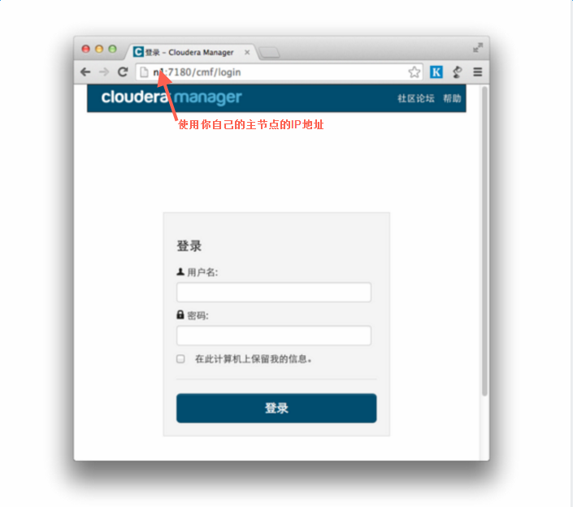
可以在下图中看到，免费版本的CM5已经没有原来50个节点数量的限制了。
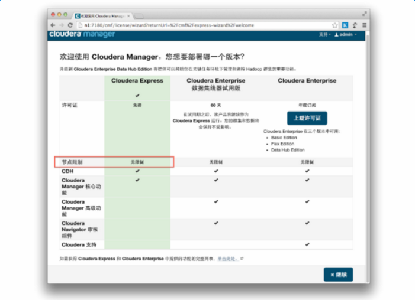
各个Agent节点正常启动后，可以在当前管理的主机列表中看到对应的节点。选择要安装的节点，点继续。
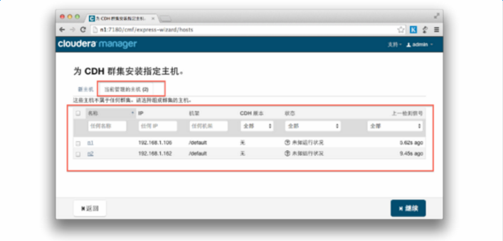
接下来，出现以下包名，说明本地Parcel包配置无误，直接点继续就可以了。
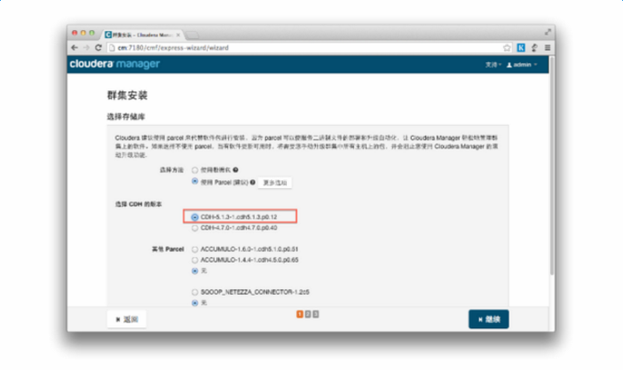
点击，继续，如果配置本地Parcel包无误，那么下图中的已下载，应该是瞬间就完成了，然后就是耐心等待分配过程就行了，大约10多分钟吧，取决于内网网速。

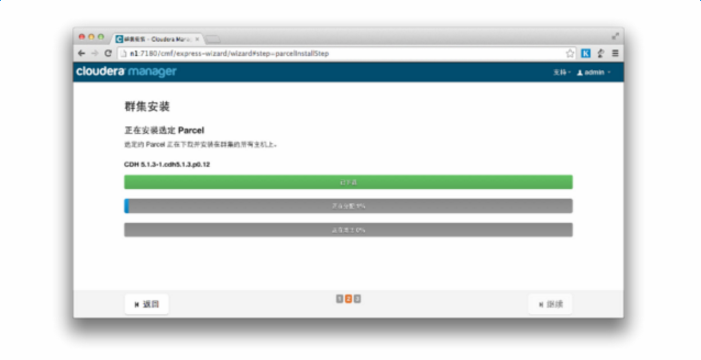

接下来是服务器检查，可能会遇到以下问题：

Cloudera 建议将 /proc/sys/vm/swappiness 设置为 0。当前设置为 60。使用 sysctl 命令在运行时更改该设置并编辑 /etc/sysctl.conf 以在重启后保存该设置。您可以继续进行安装，但可能会遇到问题，Cloudera Manager 报告您的主机由于交换运行状况不佳。以下主机受到影响：
通过 `echo 0 > /proc/sys/vm/swappiness `(在主每个点的主机上运行）即可解决。
下面还有一个问题，是hive数据库缺少MySQL的jdbc的jar包，可以使用下面的命令：

```
cp /opt/cm-5.3.2/share/cmf/lib/mysql-connector-java-5.1.36-bin.jar /opt/cloudera/parcels/CDH-5.3.2-1.cdh5.3.2.p0.10/lib/hive/lib/
```

运行完成以后，点击继续。

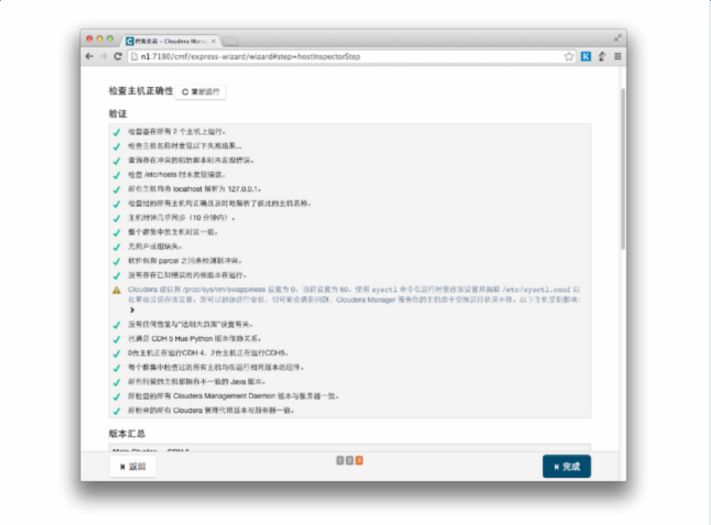


只有当所有选项前面都有对号之后才是正确的。  
接下来是选择安装服务：
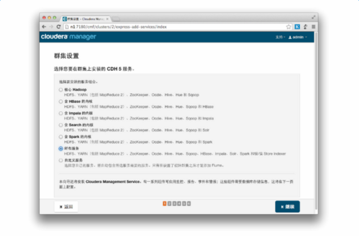
服务配置，一般情况下保持默认就可以了（Cloudera Manager会根据机器的配置自动进行配置，如果需要特殊调整，自行进行设置就可以了）：
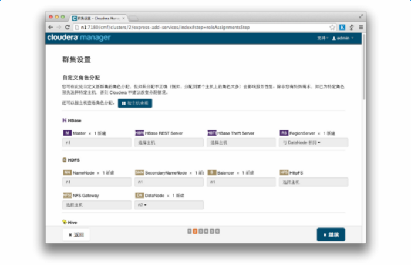
接下来是数据库的设置，检查通过后就可以进行下一步的操作了：
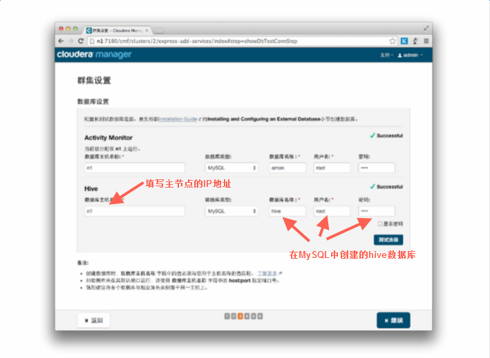
下面是集群设置的审查页面，我这里都是保持默认配置的：
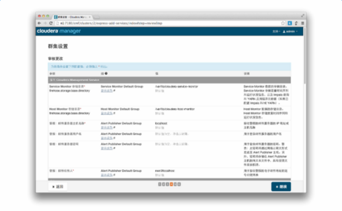
终于到安装各个服务的地方了，注意，这里安装Hive的时候可能会报错，因为我们使用了MySql作为hive的元数据存储，hive默认没有带mysql的驱动，通过以下命令拷贝一个就行了：

```
cp /opt/cm-5.3.2/share/cmf/lib/mysql-connector-java-5.1.36-bin.jar /opt/cloudera/parcels/CDH-5.3.2-1.cdh5.2.3.p0.12/lib/hive/lib/
```]

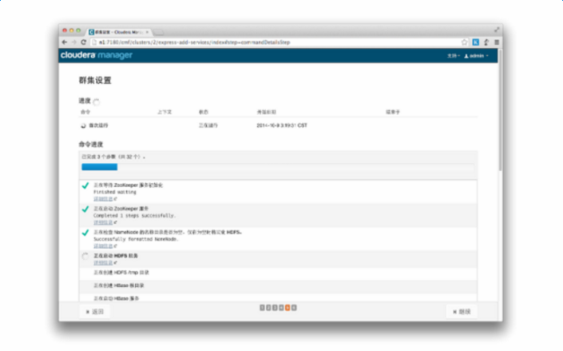
服务的安装过程大约半小时内就可以完成：

安装完成后，就可以进入集群界面看一下集群的当前状况了。

这里可能会出现 无法发出查询：对 Service Monitor 的请求超时 的错误提示，如果各个组件安装没有问题，一般是因为服务器比较卡导致的，过一会刷新一下页面就好了：
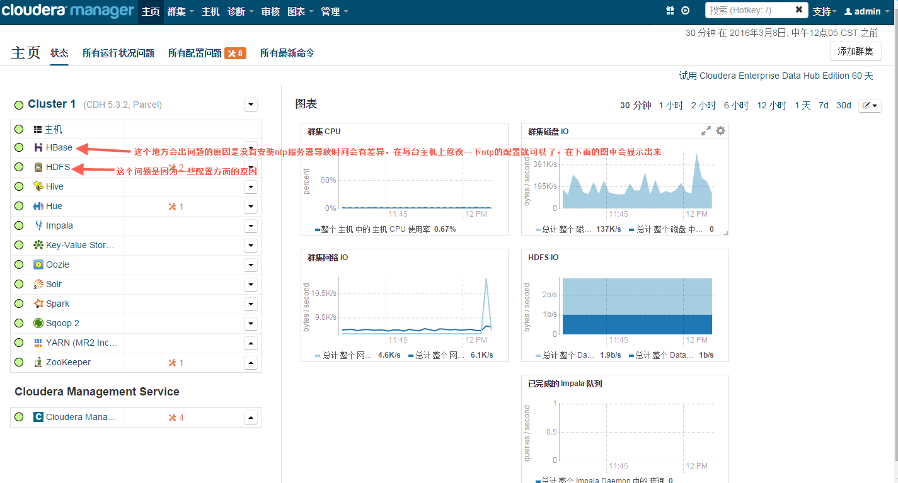
在每台主机上面修改一下ntp的配置就可：
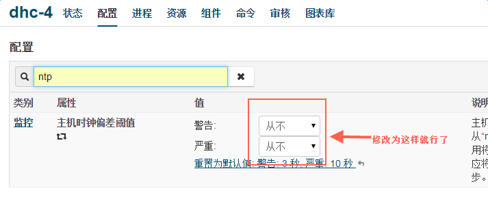


还有一个要修改的地方,就是到最后的话会在HDFS上面出错，可以使用下面的命令进行配置： 
```
sudo -u oozie bash
hadoop fs -setrep -R 1 /
```

还有另外一个配置的地方只有等安装完成以后出错了才可以修改！  
其他资料可参考：<http://www.tuicool.com/articles/ENjmeaY/>