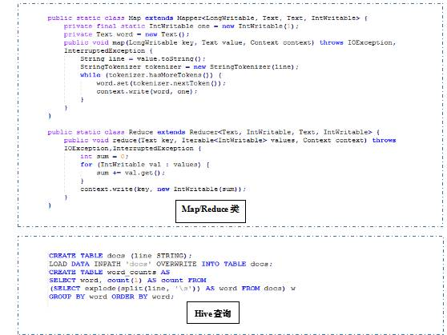
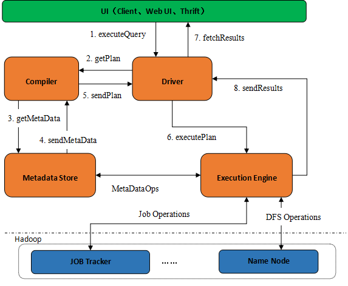
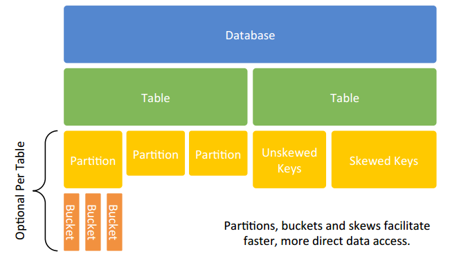
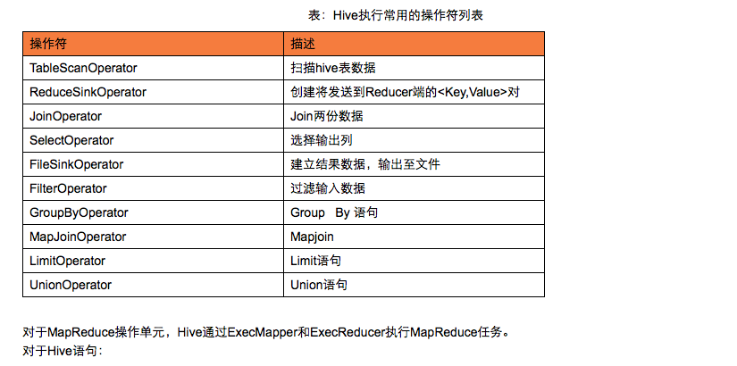
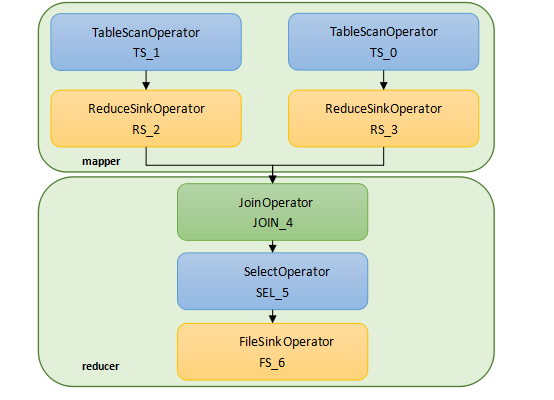
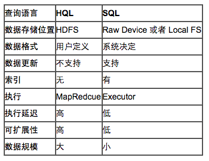

# 第八章 Hive的安装与数据导入导出

## 一 Hive介绍

即使像Hadoop这样强大的工具,也不能满足每个人的需求,许多项目如雨后春笋般涌现出来,为特定的扩展了Hadoop,那些比较突出的并且得到很好维护的项目已经正式成为Apache Hadoop项目下的子项目.
Hive是Hadoop家族中一款数据仓库产品，Hive最大的特点就是提供了类SQL的语法，封装了底层的MapReduce过程，让有SQL基础的业务人员，也可以直接利用Hadoop进行大数据的操作。就是这一个点，解决了原数据分析人员对于大数据分析的瓶颈。
让我们把Hive的环境构建起来，帮助非开发人员也能更好地了解大数据。

### 1 Hive介绍

Hive起源于Facebook，它使得针对Hadoop进行SQL查询成为可能，从而非程序员也可以方便地使用。Hive是基于Hadoop的一个数据仓库工具，可以将结构化的数据文件映射为一张数据库表，并提供完整的SQL查询功能，可以将SQL语句转换为MapReduce任务运行。

Hive是建立在 Hadoop 上的数据仓库基础构架。它提供了一系列的工具，可以用来进行数据提取转化加载（ETL），这是一种可以存储、查询和分析存储在 Hadoop 中的大规模数据的机制。

Hive 定义了简单的类 SQL 查询语言，称为 HQL，它允许熟悉 SQL 的用户查询数据。同时，这个语言也允许熟悉 MapReduce 开发者的开发自定义的 mapper 和 reducer 来处理内建的 mapper 和 reducer 无法完成的复杂的分析工作。

Hive是建立在Hadoop基础上的数据仓库软件包,在开始阶段,它被Facebook用于处理大量的用户数据和日志数据.它现在是Hadoop的子项目并有许多贡献者.其目标用户仍然是习惯SQL的数据分析师,他们需要在Hadoop规模的数据上做即席查询\/汇总和数据分析.通过称为HiveQL的类SQL语言,你可以发起一个查询来实现与Hive的交互.

Hive是基于Hadoop的数据仓库平台，由Facebook贡献，其支持类似SQL的结构化查询功能。Facebook设计开发Hive的初衷就是让那些熟悉sql编程方式的人也可以更好的利用hadoop，hive可以让数据分析人员只关注于具体业务模型，而不需要深入了解Map\/Reduce的编程细节，但是这并不意味着使用hive不需要了解和学习Map\/Reduce编程模型和hadoop，复杂的业务需求和模型总是存在的，对于Hive分析人员来说，深入了解Hadoop和Hive的原理和Mapreduce模型，对于优化查询总有益处。

Hive不是一个完整的数据库.Hadoop以及HDFS的设计本身约束和局限性地限制了Hive所能胜任的工作.其中最大的限制就是Hive不支持记录级别的更新\/插入\/删除操作.但是用户可以通过查询生成新表或者将查询结果导入到文件中.同时,因为Hadoop是一个面向批处理的系统,而MapReduce任务\(job\)的启动过程需要消耗较长时间,所以Hive查询延迟比较严重.传统数据库中在秒级别可以完成的查询,在Hive中,即使用数据集比较小,往往也需要执行更长的时间,最后需要说明的是Hive不支持事务.

因此Hive不支持联机事务处理OLTP,所需要的关键功能,而更接近一个OLAP联机分析技术工具.但是我们将会看到由于HADOOP本身的时间开销巨大,并且HADOOP所被设计用来处理的数据规模非常大,因此提交查询和返回结果是可能有非常大的延迟的,所以HIVE并没有满足OLAP中的联机部分.至少目前并没有满足.

因此Hive最适合数据仓库应用程序,其可以维护海量数据,而且可以对数据进行挖掘,然后形成意见和报告等.

### 2 实现机制

以下先以一个简单的例子说明利用hadoop Map\/Reduce程序和Hive实现hadoop word count的例子。

通过以上可以看出，hive优点：成本低，可以通过类sql语句快速实现简单或复杂的MapReduce统计。借助于Hadoop和HDFS的大数据存储能力，数据仍然存储于Hadoop的HDFS中，Hive提供了一种类SQL的查询语言：HiveQL（HQL），对数据进行管理和分析，开发人员可以近乎sql的方式来实现逻辑，从而加快应用开发效率。

HQL经过解析和编译，最终会生成基于Hadoop平台的Map Reduce任务，Hadoop通过执行这些任务来完成HQL的执行。Hive的设计体风出它是一个管理和查询结构化数据的系统.通过专注结构化数据,Hive可以实现MapReduce一般所不具备的某些优化和可用性功能.受到SQL影响的Hive语言让用户可以脱离MapReduce一般所不具备的某些优化和可用性功能.受到SQL影响的Hive语言让用户可以脱离MapREduce编程的复杂性.它沿用了关系数据库的常见概念,如表\/行\/列\/Schema,以便于学习.此外,虽然Hadoop天生支持平坦文件,但Hive可以使用目录结构来划分数据,以提高某些查询的性能.为支持这些额外的功能,Hive有一个全新且重要的组件,它就是用于存储schema信息的metastore.这个metastore通常只有在关系型数据库中才有的.

Hive的组件总体上可以分为以下几个部分：用户接口（UI）、驱动、编译器、元数据（Hive系统参数数据）和执行引擎。



1. 对外的接口UI包括以下几种：命令行CLI，Web界面、JDBC\/ODBC接口；
2. 驱动：接收用户提交的查询HQL；
3. 编译器：解析查询语句，执行语法分析，生成执行计划；
4. 元数据Metadata：存放系统的表、分区、列、列类型等所有信息，以及对应的HDFS文件信息等；
5. 执行引擎：执行执行计划，执行计划是一个有向无环图，执行引擎按照各个任务的依赖关系选择执行任务（Job）。

需要注意的是，元数据库一般是通过关系型数据库MySQL或者支持JDBC驱动的关系型数据库来存储。元数据维护了库信息、表信息、列信息等所有内容，例如表T包含哪些列，各列的类型等等。因此元数据库十分重要，需要定期备份以及支持查询的扩展性。

读时验证机制

与传统数据库对表数据进行写时严重不同，Hive对数据的验证方式为读时模式，即只有在读表数据的时候，hive才检查解析具体的字段、shema等，从而保证了大数据量的快速加载。
既然hive采用的读时验证机制，那么 如果表schema与表文件内容不匹配，会发生什么呢？

答案是hive会尽其所能的去读数据。如果schema中表有10个字段，而文件记录却只有3个字段，那么其中7个字段将为null；如果某些字段类型定位为数值类型，但是记录中却为非数值字符串，这些字段也将会被转换为null。简而言之，hive会努力catch读数据时遇到的错误，并努力返回。

既然Hive表数据存储在HDFS中且Hive采用的是读时验证方式，定义完表的schema会自动生成表数据的HDFS目录，且我们可以以任何可能的方式来加载表数据或者利用HDFS API将数据写入文件，同理，当我们若需要将hive数据写入其他库（如oracle），也可以直接通过api读取数据再写入目标库。在实际生产环境中，当需要数据仓库之间的迁移时，就可以直接利用api将源库的数据直接写入hive库的表文件中，包括淘宝开源的datax数据交换系统都采用类似的方式来交换跨库数据。

再次注意，加载或者写入的数据内容要和表定义的schema一致，否则将会造成字段或者表为空。

### 3.Hive的数据模型

从数据仓库的角度看，Hive是建立在Hadoop上的数据仓库基础架构，可以方便的ETL操作。Hive没有专门的数据存储格式，也没有为数据建立索引，用于可以非常自由的组织Hive中的表，只需要在创建表的时候定义好表的schema即可。Hive中包含4中数据模型：Tabel、ExternalTable、Partition、Bucket。



* Table：类似与传统数据库中的Table，每一个Table在Hive中都有一个相应的目录来存储数据。例如：一个表t，它在HDFS中的路径为：\/user\/hive\/warehouse\/t。
* Partition：类似于传统数据库中划分列的索引。在Hive中，表中的一个Partition对应于表下的一个目录，所有的Partition数据都存储在对应的目录中。例如：t表中包含ds和city两个Partition，则对应于ds=2014，city=beijing的HDFS子目录为：\/user\/hive\/warehouse\/t\/ds=2014\/city=Beijing；
  需要注意的是，分区列是表的伪列，表数据文件中并不存在这个分区列的数据。
* Buckets：对指定列计算的hash，根据hash值切分数据，目的是为了便于并行，每一个Buckets对应一个文件。将user列分数至32个Bucket上，首先对user列的值计算hash，比如，对应hash=0的HDFS目录为：\/user\/hive\/warehouse\/t\/ds=2014\/city=Beijing\/part-00000；对应hash=20的目录为：\/user\/hive\/warehouse\/t\/ds=2014\/city=Beijing\/part-00020。
* External Table指向已存在HDFS中的数据，可创建Partition。Managed Table创建和数据加载过程，可以用统一语句实现，实际数据被转移到数据仓库目录中，之后对数据的访问将会直接在数据仓库的目录中完成。删除表时，表中的数据和元数据都会删除。External Table只有一个过程，因为加载数据和创建表是同时完成。数据是存储在Location后面指定的HDFS路径中的，并不会移动到数据仓库中。

### 4.Hive如何转化成Mapreduce

Hive编译器将HQL代码转换成一组操作符（operator），操作符是Hive的最小操作单元，每个操作符代表了一种HDFS操作或者MapReduce作业。Hive中的操作符包括：



```
INSERT OVERWRITE TABLE read_log_tmp
SELECT a.userid,a.bookid,b.author,b.categoryid
FROM user_read_log a JOIN book_info b ON a.bookid = b.bookid;
```



## 二 Hive与其他数据库的区别
由于 Hive 采用了 SQL 的查询语言 HQL，因此很容易将 Hive 理解为数据库。其实从结构上来看，Hive 和数据库除了拥有类似的查询语言，再无类似之处。
本文将从多个方面来阐述 Hive 和数据库的差异。数据库可以用在 Online 的应用中，但是Hive 是为数据仓库而设计的，清楚这一点，有助于从应用角度理解 Hive 的特性。

**Hive 和数据库的比较**


1. 查询语言。由于 SQL 被广泛的应用在数据仓库中，因此，专门针对 Hive 的特性设计了类 SQL 的查询语言 HQL。熟悉 SQL 开发的开发者可以很方便的使用 Hive 进行开发。

2. 数据存储位置。Hive 是建立在 Hadoop 之上的，所有 Hive 的数据都是存储在 HDFS 中的。而数据库则可以将数据保存在块设备或者本地文件系统中。

3. 数据格式。Hive 中没有定义专门的数据格式，数据格式可以由用户指定，用户定义数据格式需要指定三个属性：列分隔符（通常为空格、”\t”、”\x001″）、行分隔符（”\n”）以及读取文件数据的方法（Hive 中默认有三个文件格式 TextFile，SequenceFile 以及 RCFile）。由于在加载数据的过程中，不需要从用户数据格式到 Hive 定义的数据格式的转换，因此，Hive 在加载的过程中不会对数据本身进行任何修改，而只是将数据内容复制或者移动到相应的 HDFS 目录中。而在数据库中，不同的数据库有不同的存储引擎，定义了自己的数据格式。所有数据都会按照一定的组织存储，因此，RDBMS数据库加载数据的过程会比较耗时。

4. 数据更新。由于 Hive 是针对数据仓库应用设计的，而数据仓库的内容是读多写少的。因此，Hive 中不支持对数据的改写和添加，所有的数据都是在加载的时候中确定好的。而数据库中的数据通常是需要经常进行修改的，因此可以使用 INSERT INTO ...  VALUES 添加数据，使用 UPDATE ... SET 修改数据。

5. 索引。之前已经说过，Hive 在加载数据的过程中不会对数据进行任何处理，甚至不会对数据进行扫描，因此也没有对数据中的某些 Key 建立索引。Hive 要访问数据中满足条件的特定值时，需要暴力扫描整个数据，因此访问延迟较高。由于 MapReduce 的引入， Hive 可以并行访问数据，因此即使没有索引，对于大数据量的访问，Hive 仍然可以体现出优势。数据库中，通常会针对一个或者几个列建立索引，因此对于少量的特定条件的数据的访问，数据库可以有很高的效率，较低的延迟。由于数据的访问延迟较高，决定了 Hive 不适合在线数据查询。

6. 执行。Hive 中大多数查询的执行是通过 Hadoop 提供的 MapReduce 来实现的（类似 select * from tbl 的查询不需要 MapReduce）。而数据库通常有自己的执行引擎。

7. 执行延迟。之前提到，Hive 在查询数据的时候，由于没有索引，需要扫描整个表，因此延迟较高。另外一个导致 Hive 执行延迟高的因素是 MapReduce 框架。由于 MapReduce 本身具有较高的延迟，因此在利用 MapReduce 执行 Hive 查询时，也会有较高的延迟。相对的，数据库的执行延迟较低。当然，这个低是有条件的，即数据规模较小，当数据规模大到超过数据库的处理能力的时候，Hive 的并行计算显然能体现出优势。hive执行延迟高，只有在数据规模达到一定程度后，其查询的高效才能弥补其高延迟的劣势。

8. 可扩展性。由于 Hive 是建立在 Hadoop 之上的，因此 Hive 的可扩展性是和 Hadoop 的可扩展性是一致的（世界上最大的 Hadoop 集群在 Yahoo!，2009年的规模在 4000 台节点左右）。而数据库由于 ACID 语义的严格限制，扩展行非常有限。目前最先进的并行数据库 Oracle 在理论上的扩展能力也只有 100 台左右。

9. 数据规模。由于 Hive 建立在集群上并可以利用 MapReduce 进行并行计算，因此可以支持很大规模的数据；对应的，数据库可以支持的数据规模较小。
